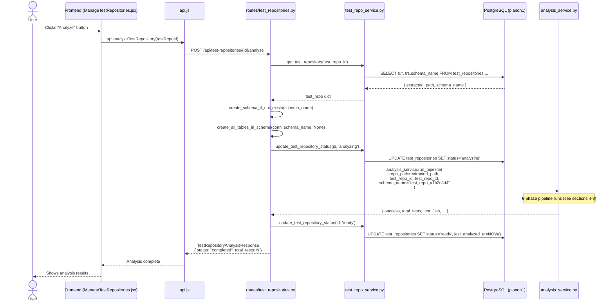
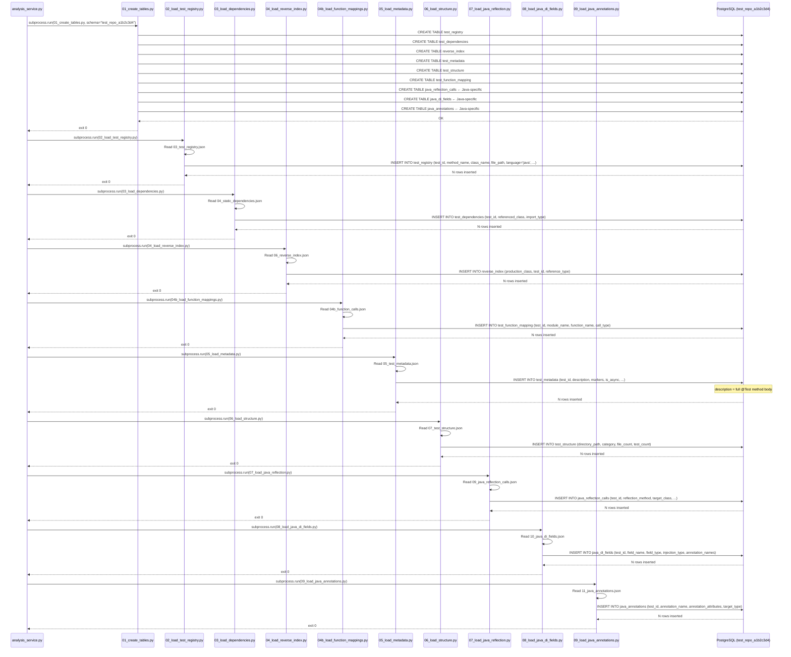
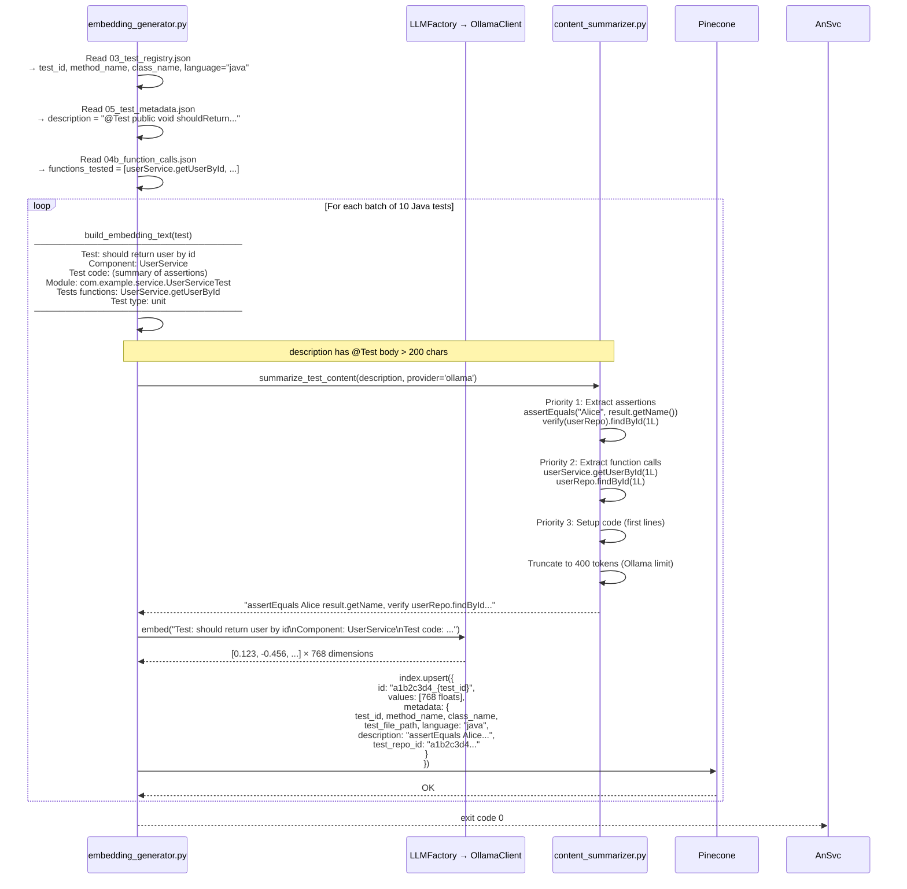

# Java Test Repository: Analysis Pipeline — run_pipeline() to status "ready"

## Overview

This document describes the **complete step-by-step internal flow** of what happens when `analysis_service.py → run_pipeline()` is called for a **Java** test repository. It covers every phase, every file that is triggered, every JSON file produced, every database table created, and how the data finally ends up in **PostgreSQL** and **Pinecone**.

---

## Table of Contents

1. [System Architecture Overview](#1-system-architecture-overview)
2. [Technology Stack (Java Pipeline)](#2-technology-stack-java-pipeline)
3. [Entry Point: Who triggers run_pipeline()](#3-entry-point-who-triggers-run_pipeline)
4. [Phase 1 — DETECT: Language & Framework Detection](#4-phase-1--detect-language--framework-detection)
5. [Phase 2 — DISPATCH: JavaAnalyzer Internal Steps](#5-phase-2--dispatch-javaanalyzer-internal-steps)
6. [Phase 3 — MERGE: Combine and Write JSON Files](#6-phase-3--merge-combine-and-write-json-files)
7. [Phase 4 — SCHEMA: Build Dynamic Database Schema](#7-phase-4--schema-build-dynamic-database-schema)
8. [Phase 5 — LOAD: Deterministic Scripts → PostgreSQL](#8-phase-5--load-deterministic-scripts--postgresql)
9. [Phase 6 — EMBED: Generate Embeddings → Pinecone](#9-phase-6--embed-generate-embeddings--pinecone)
10. [Database Tables Created (Java)](#10-database-tables-created-java)
11. [All JSON Files Produced](#11-all-json-files-produced)
12. [Status Lifecycle](#12-status-lifecycle)
13. [Key Files Reference](#13-key-files-reference)

---

## 1. System Architecture Overview

```mermaid
graph TB
    subgraph Trigger ["API Trigger"]
        RT[routes/test_repositories.py<br/>POST /{id}/analyze]
    end

    subgraph Pipeline ["analysis_service.py — run_pipeline()"]
        P1[Phase 1: DETECT<br/>Language & Framework]
        P2[Phase 2: DISPATCH<br/>JavaAnalyzer]
        P3[Phase 3: MERGE<br/>Write JSON files]
        P4[Phase 4: SCHEMA<br/>Build DB Schema]
        P5[Phase 5: LOAD<br/>14 deterministic scripts]
        P6[Phase 6: EMBED<br/>Pinecone storage]
    end

    subgraph JavaAnalyzer ["JavaAnalyzer — 9 Internal Steps"]
        J1[Step 1: Scan *.java test files]
        J2[Step 2: Detect framework<br/>JUnit4/5/TestNG]
        J3[Step 3: Extract @Test methods]
        J4[Step 4: Extract dependencies<br/>import statements]
        J5[Step 5: Extract function calls<br/>obj.method() patterns]
        J6[Step 6: Extract metadata<br/>method body content]
        J7[Step 7: Build reverse index<br/>class → tests]
        J8[Step 8: Map test structure<br/>directory categories]
        J9[Step 9: Extract Java-specific<br/>reflection, DI fields, annotations]
    end

    subgraph JSONFiles ["JSON Output Files<br/>test_analysis/outputs/{schema_name}/"]
        F1[01_test_files.json]
        F2[02_framework_detection.json]
        F3[03_test_registry.json]
        F4[04_static_dependencies.json]
        F4b[04b_function_calls.json]
        F5[05_test_metadata.json]
        F6[06_reverse_index.json]
        F7[07_test_structure.json]
        F8[08_summary_report.json]
        F9[09_java_reflection_calls.json]
        F10[10_java_di_fields.json]
        F11[11_java_annotations.json]
    end

    subgraph CoreTables ["PostgreSQL — Core Tables<br/>test_repo_{hash8} schema"]
        T1[(test_registry)]
        T2[(test_dependencies)]
        T3[(reverse_index)]
        T4[(test_metadata)]
        T5[(test_structure)]
        T6[(test_function_mapping)]
    end

    subgraph JavaTables ["PostgreSQL — Java-Specific Tables"]
        TJ1[(java_reflection_calls)]
        TJ2[(java_di_fields)]
        TJ3[(java_annotations)]
    end

    subgraph VectorDB ["Pinecone Vector Database"]
        PC[Index: test-embeddings<br/>768-dim vectors<br/>1 vector per test]
    end

    RT -->|calls| P1
    P1 --> P2
    P2 --> J1 --> J2 --> J3 --> J4 --> J5 --> J6 --> J7 --> J8 --> J9
    J9 --> P3
    P3 --> F1 & F2 & F3 & F4 & F4b & F5 & F6 & F7 & F8 & F9 & F10 & F11
    P3 --> P4
    P4 --> P5
    P5 -->|reads JSONs| T1 & T2 & T3 & T4 & T5 & T6
    P5 -->|reads JSONs| TJ1 & TJ2 & TJ3
    P5 --> P6
    P6 -->|vectors| PC
```

---

## 2. Technology Stack (Java Pipeline)

| Layer | Technology | Purpose |
|-------|-----------|---------|
| API | FastAPI | Receives `POST /{id}/analyze` request |
| Orchestrator | `analysis_service.py` | Coordinates all 6 phases |
| Language Detection | Custom file scanner | Identifies `.java` files, detects `import org.junit.*` |
| Java Analyzer | `JavaAnalyzer` (Regex) | Extracts `@Test` methods, dependencies, annotations |
| JSON Producer | `JavaAnalyzer._write_outputs()` | Writes 11 JSON files to `test_analysis/outputs/{schema}/` |
| Schema Builder | `test_analysis.core.schema` | Decides which tables to create (core + java-specific) |
| DB Loader | 14 Python scripts (`deterministic/`) | Reads JSON → inserts into PostgreSQL |
| Database | PostgreSQL (psycopg2) | Stores all extracted test data |
| Embedding Generator | `embedding_generator.py` | Reads JSON, builds text, calls LLMFactory |
| Model Abstraction | `LLMFactory` | Pluggable: Ollama / OpenAI / Gemini |
| Vector Database | Pinecone | Stores test embeddings for semantic search |

---

## 3. Entry Point: Who triggers run_pipeline()

### Full Call Chain



---

## 4. Phase 1 — DETECT: Language & Framework Detection

### What happens

```python
# analysis_service.py → run_pipeline()
detection_report = create_detection_report(
    repo_path,
    include_test_files_only=True,
    framework_sample_size=50
)
detected_languages = detection_report.get_languages()
# → ['java']
```

### For a Java repository

| Check | How | Result |
|-------|-----|--------|
| File extension scan | Look for `*.java` files | Java detected |
| Test file names | Match `*Test.java`, `*Tests.java`, `Test*.java` | Java test files found |
| Framework detection | Scan imports: `org.junit.jupiter` → JUnit5, `org.junit` → JUnit4, `org.testng` → TestNG | e.g., `junit5` with `high` confidence |
| `detected_languages` | List of languages found | `['java']` |

---

## 5. Phase 2 — DISPATCH: JavaAnalyzer Internal Steps

### What happens

```python
# analysis_service.py
analyzer = self._analyzers['java']   # → JavaAnalyzer()
result = analyzer.analyze(repo_path, output_dir)
```

`JavaAnalyzer.analyze()` runs **9 internal steps in sequence**:

---

### Step 1 — Scan Test Files (`_scan_test_files`)

```python
# Walks all directories, skips: target/, build/, .git/, .gradle/, .idea/
for filepath in repo_path.rglob('*.java'):
    if any(pattern.match(filepath.name) for pattern in JAVA_TEST_PATTERNS):
        test_files.append(filepath)
```

**Patterns matched:**
- `*Test.java` → e.g., `UserServiceTest.java`
- `*Tests.java` → e.g., `UserServiceTests.java`
- `*TestCase.java` → e.g., `UserTestCase.java`
- `Test*.java` → e.g., `TestUserService.java`

**Result:** `test_files = [Path("src/test/.../UserServiceTest.java"), ...]`

---

### Step 2 — Detect Framework (`_detect_framework`)

```python
for filepath in test_files[:50]:   # samples 50 files
    if 'import org.junit.jupiter' in content:  votes['junit5'] += 1
    if 'import org.junit'         in content:  votes['junit4'] += 1
    if 'import org.testng'        in content:  votes['testng'] += 1
```

**Result:** e.g., `framework='junit5'`, `confidence='high'`

---

### Step 3 — Extract Tests (`_extract_tests`)

For each `.java` file, reads content and finds test methods using regex:

```
@Test
@ParameterizedTest
@RepeatedTest
     ↓
public void methodName()
```

**What is extracted per test:**

| Field | Example |
|-------|---------|
| `test_id` | `"test_0001"` (sequential counter) |
| `method_name` | `"shouldReturnUserById"` |
| `class_name` | `"UserServiceTest"` |
| `file_path` | `/path/to/UserServiceTest.java` |
| `line_number` | `42` |
| `test_type` | `"unit"` / `"integration"` / `"e2e"` (from path) |
| `language` | `"java"` |
| `package` | `"com.example.service"` |
| `framework` | `"junit5"` |

> `test_type` is inferred from file path: `integration/` → `"integration"`, `e2e/` → `"e2e"`, otherwise `"unit"`

---

### Step 4 — Extract Dependencies (`_extract_dependencies`)

Uses the **Java Dependency Plugin** (`dependency_plugins.get_plugin('java')`):

```
For each test file:
  plugin.extract_dependencies(filepath)
  → production_classes    (direct imports: import com.example.UserService)
  → inferred_references   (type references in code)
  → import_count          (only actual import statements)
```

**What is extracted:**

| Field | Example |
|-------|---------|
| `test_id` | `"test_0001"` |
| `referenced_classes` | `["UserService", "UserRepository"]` |
| `reference_types` | `{"UserService": "direct_import"}` |
| `import_count` | `2` (only direct imports) |
| `inferred_count` | `1` (e.g., used in code but not imported) |

---

### Step 5 — Extract Function Calls (`_extract_function_calls`)

Regex scans each test file for `object.method(` patterns:

```java
userService.getUserById(1)   → module="userService", function="getUserById"
orderRepo.save(order)        → module="orderRepo",   function="save"
```

**Filters out** test framework calls: `mockito.`, `assert.`, `verify.`, `when.`, `given.`

---

### Step 6 — Extract Metadata (`_extract_metadata`)

For each test, calls `_extract_test_content()` to extract the **full method body**:

```java
@Test
public void shouldReturnUserById() {
    // Setup
    User mockUser = new User(1L, "Alice");
    when(userRepo.findById(1L)).thenReturn(Optional.of(mockUser));

    // Act
    User result = userService.getUserById(1L);

    // Assert
    assertEquals("Alice", result.getName());
    verify(userRepo).findById(1L);
}
```

The entire body above is stored as the `description` field in `test_metadata`. This content is later used by `content_summarizer.py` to generate **smart embedding text**.

**Technique used:** Regex finds `@Test ... void methodName(...)` → brace-counting to find matching `}`.

---

### Step 7 — Build Reverse Index (`_build_reverse_index`)

Inverts the dependency data:

```
Input:  test_0001 → [UserService, UserRepository]
        test_0002 → [UserService, OrderService]

Output: UserService    → [test_0001, test_0002]
        UserRepository → [test_0001]
        OrderService   → [test_0002]
```

Used for: **"Which tests cover this production class?"**

---

### Step 8 — Map Test Structure (`_map_test_structure`)

Groups test files by category based on their directory paths:

```
src/test/unit/       → category: "unit"
src/test/integration → category: "integration"
src/test/e2e/        → category: "e2e"
```

Counts tests per directory for the dashboard summary.

---

### Step 9 — Java-Specific Extractions

Three extra extractions happen only for Java:

#### 9a — Reflection Calls (`_extract_reflection_calls`)

Finds usage of Java Reflection API:

| Pattern detected | `reflection_method` |
|-----------------|---------------------|
| `Class.forName("com.example.X")` | `forName` |
| `.getDeclaredMethod("methodName")` | `getDeclaredMethod` |
| `.getDeclaredField("fieldName")` | `getDeclaredField` |
| `.invoke(...)` | `invoke` |
| `ReflectionTestUtils.setField(...)` | `setField` |

#### 9b — DI Fields (`_extract_di_fields`)

Finds dependency-injected fields:

```java
@Autowired
private UserService userService;    → field_name="userService", field_type="UserService", annotation="Autowired"

@Mock
private UserRepository userRepo;    → field_name="userRepo", field_type="UserRepository", annotation="Mock"
```

**Annotations detected:** `@Autowired`, `@Inject`, `@Mock`, `@MockBean`, `@Spy`, `@SpyBean`, `@InjectMocks`, `@Captor`, `@Value`, `@Resource`

#### 9c — Annotations (`_extract_annotations`)

Captures ALL annotations at **class-level** and **method-level**:

```java
@SpringBootTest             ← class-level: target_type="class"
@Transactional
class UserServiceTest {

    @Test                   ← method-level: target_type="method"
    @DisplayName("...")
    void shouldReturn...()
```

---

## 6. Phase 3 — MERGE: Combine and Write JSON Files

### What happens

```python
# analysis_service.py
merged_summary = merge_analyzer_results(analyzer_results, output_dir)
```

`JavaAnalyzer._write_outputs()` writes **11 JSON files** to:
```
test_analysis/outputs/{schema_name}/
```

### JSON Files Produced (Java)

| File | Contents | Used by |
|------|---------|---------|
| `01_test_files.json` | List of all `.java` test files with line counts | Frontend UI stats |
| `02_framework_detection.json` | `primary_framework: "junit5"`, confidence | Frontend display |
| `03_test_registry.json` | All tests: `test_id`, `method_name`, `class_name`, `line_number`, `language: "java"` | `02_load_test_registry.py` + `embedding_generator.py` |
| `04_static_dependencies.json` | Per-test: `referenced_classes[]`, `import_count` | `03_load_dependencies.py` |
| `04b_function_calls.json` | Per-test: `module_name`, `function_name` pairs | `04b_load_function_mappings.py` + `embedding_generator.py` |
| `05_test_metadata.json` | Per-test: `description` (full method body), `markers:[]`, `is_async: false` | `05_load_metadata.py` + `embedding_generator.py` |
| `06_reverse_index.json` | `production_class → [test_id, ...]` | `04_load_reverse_index.py` |
| `07_test_structure.json` | Directory structure: category + test_count | `06_load_structure.py` |
| `08_summary_report.json` | Statistics summary | Frontend dashboard |
| `09_java_reflection_calls.json` | Reflection API calls per test | `07_load_java_reflection.py` |
| `10_java_di_fields.json` | `@Autowired`/`@Mock` fields per test | `08_load_java_di_fields.py` |
| `11_java_annotations.json` | All annotations (class + method level) | `09_load_java_annotations.py` |

---

## 7. Phase 4 — SCHEMA: Build Dynamic Database Schema

### What happens

```python
schema_def = build_schema_for_detection(detection_report.to_dict())
# For Java repo:
# schema_def.core_tables = ['test_registry', 'test_dependencies', 'reverse_index',
#                            'test_metadata', 'test_structure', 'test_function_mapping']
# schema_def.java_tables = ['java_reflection_calls', 'java_di_fields', 'java_annotations']
# schema_def.python_tables = []   ← empty for Java
# schema_def.js_tables = []       ← empty for Java

os.environ['SCHEMA_DEFINITION'] = json.dumps(schema_def.to_dict())
```

The schema definition is passed to the LOAD phase so `01_create_tables.py` knows which language-specific tables to create.

---

## 8. Phase 5 — LOAD: Deterministic Scripts → PostgreSQL

### What happens

```python
# analysis_service.py → _load_to_database()
scripts = [
    "deterministic/01_create_tables.py",          # Create all tables
    "deterministic/02_load_test_registry.py",      # Tests list
    "deterministic/03_load_dependencies.py",       # Import dependencies
    "deterministic/04_load_reverse_index.py",      # Reverse index
    "deterministic/04b_load_function_mappings.py", # Function calls
    "deterministic/05_load_metadata.py",           # Descriptions + content
    "deterministic/06_load_structure.py",          # Directory structure
    "deterministic/07_load_java_reflection.py",    # ← Java-specific
    "deterministic/08_load_java_di_fields.py",     # ← Java-specific
    "deterministic/09_load_java_annotations.py",   # ← Java-specific
    ...
]
for script in scripts:
    subprocess.run([sys.executable, script], env={'TEST_REPO_SCHEMA': schema_name})
```

Each script reads from a JSON file and inserts into PostgreSQL.

### Sequence Diagram



---

## 9. Phase 6 — EMBED: Generate Embeddings → Pinecone

### What happens

```python
# analysis_service.py → _generate_embeddings()
env['TEST_REPO_ID']     = test_repo_id      # e.g., "a1b2c3d4..."
env['TEST_REPO_SCHEMA'] = schema_name       # e.g., "test_repo_a1b2c3d4"

subprocess.run(
    [sys.executable, "semantic_retrieval/embedding_generator.py"],
    env=env,
    timeout=1800   # 30 minutes
)
```

### Embedding Generation Flow (for Java tests)



---

## 10. Database Tables Created (Java)

Schema name: `test_repo_{hash8}` (e.g., `test_repo_a1b2c3d4`)

### Core Tables (created for ALL languages)

```sql
-- All test methods found
CREATE TABLE test_repo_a1b2c3d4.test_registry (
    test_id         VARCHAR(50) PRIMARY KEY,     -- "test_0001"
    file_path       TEXT NOT NULL,               -- "/path/UserServiceTest.java"
    class_name      VARCHAR(255),                -- "UserServiceTest"
    method_name     VARCHAR(255) NOT NULL,        -- "shouldReturnUserById"
    test_type       VARCHAR(50),                 -- "unit" | "integration" | "e2e"
    line_number     INTEGER,                     -- 42
    language        VARCHAR(20) DEFAULT 'java',  -- "java"
    repository_path TEXT,
    created_at      TIMESTAMP
);
-- Indexes: file_path, class_name, test_type, language

-- Production classes imported by each test
CREATE TABLE test_repo_a1b2c3d4.test_dependencies (
    id              SERIAL PRIMARY KEY,
    test_id         VARCHAR(50) NOT NULL,         -- FK → test_registry
    referenced_class TEXT NOT NULL,              -- "com.example.UserService"
    import_type     VARCHAR(50),                 -- "direct_import"
    created_at      TIMESTAMP
);
-- Indexes: test_id, referenced_class

-- Inverted index: production class → tests that cover it
CREATE TABLE test_repo_a1b2c3d4.reverse_index (
    id               SERIAL PRIMARY KEY,
    production_class TEXT NOT NULL,              -- "UserService"
    test_id          VARCHAR(50) NOT NULL,        -- FK → test_registry
    test_file_path   TEXT,
    reference_type   VARCHAR(20),                -- "direct_import" | "method_call"
    created_at       TIMESTAMP
);
-- Indexes: production_class, test_id, reference_type, (production_class, test_id)

-- Test description + method body content
CREATE TABLE test_repo_a1b2c3d4.test_metadata (
    id               SERIAL PRIMARY KEY,
    test_id          VARCHAR(50) UNIQUE NOT NULL,  -- FK → test_registry
    description      TEXT,                        -- Full @Test method body
    markers          JSONB,                       -- [] (empty for Java - no pytest markers)
    is_async         BOOLEAN DEFAULT FALSE,       -- Always false for Java
    is_parameterized BOOLEAN DEFAULT FALSE,
    pattern          VARCHAR(50),                 -- "annotation_based"
    line_number      INTEGER,
    created_at       TIMESTAMP
);
-- Indexes: test_id, pattern, markers(GIN)

-- Directory structure of test repo
CREATE TABLE test_repo_a1b2c3d4.test_structure (
    id             SERIAL PRIMARY KEY,
    directory_path TEXT NOT NULL UNIQUE,          -- "src/test/java/unit"
    category       VARCHAR(50),                  -- "unit" | "integration" | "e2e"
    file_count     INTEGER,                      -- 5
    test_count     INTEGER DEFAULT 0,            -- 23
    total_lines    INTEGER,
    created_at     TIMESTAMP
);
-- Indexes: category, directory_path

-- Production functions called by each test
CREATE TABLE test_repo_a1b2c3d4.test_function_mapping (
    id            SERIAL PRIMARY KEY,
    test_id       VARCHAR(50) NOT NULL,           -- FK → test_registry
    module_name   TEXT NOT NULL,                  -- "UserService"
    function_name VARCHAR(255) NOT NULL,          -- "getUserById"
    call_type     VARCHAR(50),                    -- "method"
    source        VARCHAR(50),                    -- "method_call"
    created_at    TIMESTAMP
);
-- Indexes: (module_name, function_name), test_id, function_name
```

### Java-Specific Tables (only created when Java is detected)

```sql
-- Java Reflection API calls used in tests
CREATE TABLE test_repo_a1b2c3d4.java_reflection_calls (
    id                SERIAL PRIMARY KEY,
    test_id           VARCHAR(50) NOT NULL,        -- FK → test_registry
    reflection_method VARCHAR(255),               -- "getDeclaredMethod"
    target_class      TEXT,                       -- "com.example.UserService"
    target_method     TEXT,                       -- "getUserById"
    target_field      TEXT,                       -- null for method reflection
    line_number       INTEGER,                    -- 87
    created_at        TIMESTAMP
);
-- Indexes: test_id, target_class

-- DI fields: @Autowired, @Mock, @MockBean etc.
CREATE TABLE test_repo_a1b2c3d4.java_di_fields (
    id               SERIAL PRIMARY KEY,
    test_id          VARCHAR(50) NOT NULL,         -- FK → test_registry
    field_name       VARCHAR(255),                -- "userService"
    field_type       TEXT,                        -- "UserService"
    injection_type   VARCHAR(50),                 -- "field" | "constructor"
    annotation_names TEXT[],                      -- ["Autowired"] or ["Mock"]
    created_at       TIMESTAMP
);
-- Indexes: test_id, field_type

-- All annotations on test classes and methods
CREATE TABLE test_repo_a1b2c3d4.java_annotations (
    id                    SERIAL PRIMARY KEY,
    test_id               VARCHAR(50) NOT NULL,    -- FK → test_registry
    annotation_name       VARCHAR(255),            -- "SpringBootTest"
    annotation_attributes JSONB,                  -- { "classes": "App.class" }
    target_type           VARCHAR(50),             -- "class" | "method"
    created_at            TIMESTAMP,
    UNIQUE(test_id, annotation_name, target_type)
);
-- Indexes: test_id, annotation_name, annotation_attributes(GIN)
```

---

## 11. All JSON Files Produced

Location: `test_analysis/outputs/{schema_name}/` (e.g., `test_analysis/outputs/test_repo_a1b2c3d4/`)

| # | File | Key Fields | Example Content |
|---|------|-----------|----------------|
| 01 | `01_test_files.json` | `total_files`, `files[path, name, line_count]` | 12 files, 450 lines each |
| 02 | `02_framework_detection.json` | `primary_framework`, `confidence` | `"junit5"`, `"high"` |
| 03 | `03_test_registry.json` | `tests[test_id, method_name, class_name, line_number, language]` | 87 tests found |
| 04 | `04_static_dependencies.json` | `test_dependencies[test_id, referenced_classes[], import_count]` | UserService, UserRepo |
| 04b | `04b_function_calls.json` | `test_function_mappings[test_id, module_name, function_name]` | userService.save |
| 05 | `05_test_metadata.json` | `test_metadata[test_id, description (method body)]` | `@Test public void...` |
| 06 | `06_reverse_index.json` | `reverse_index{class: [test_ids]}` | `UserService: [test_0001, test_0005]` |
| 07 | `07_test_structure.json` | `directory_structure{directories{unit, integration}}` | unit: 8 files, integration: 4 files |
| 08 | `08_summary_report.json` | `total_tests, total_classes, framework` | 87 tests, 12 classes, junit5 |
| 09 | `09_java_reflection_calls.json` | `reflection_calls[test_id, reflection_method, target_class]` | getDeclaredMethod |
| 10 | `10_java_di_fields.json` | `di_fields[test_id, field_name, field_type, annotation_names]` | @Autowired UserService |
| 11 | `11_java_annotations.json` | `annotations[test_id, annotation_name, target_type]` | @SpringBootTest, @Test |

---

## 12. Status Lifecycle

```
planon1.test_repositories.status transitions:

"pending"    ← right after ZIP upload
    ↓
    User clicks "Analyze"
    ↓
"analyzing"  ← set before run_pipeline() starts
    ↓
    Phase 1: DETECT
    Phase 2: DISPATCH (JavaAnalyzer runs ~2-5 min for large repos)
    Phase 3: MERGE   (JSON files written)
    Phase 4: SCHEMA  (schema_def built)
    Phase 5: LOAD    (14 scripts run, each ~5-30 sec)
    Phase 6: EMBED   (embedding_generator.py, ~5-30 min)
    ↓
"ready"      ← set after run_pipeline() returns successfully
    ↓
    OR
    ↓
"error"      ← set if any exception is raised
```

**Database update:**
```sql
-- When analysis starts
UPDATE planon1.test_repositories
SET status = 'analyzing', last_analyzed_at = NOW()
WHERE id = ?;

-- When analysis completes
UPDATE planon1.test_repositories
SET status = 'ready', last_analyzed_at = NOW()
WHERE id = ?;
```

---

## 13. Key Files Reference

| File | Role |
|------|------|
| `web_platform/frontend/src/pages/ManageTestRepositories.jsx` | UI: "Analyze" button that starts the chain |
| `web_platform/frontend/src/services/api.js` | `api.analyzeTestRepository(id)` → HTTP POST |
| `web_platform/api/routes/test_repositories.py` | `@router.post("/{id}/analyze")` → calls `analysis_service.run_pipeline()` |
| `web_platform/services/test_repo_service.py` | `update_test_repository_status()` → sets "analyzing" / "ready" / "error" |
| `web_platform/services/analysis_service.py` | **Main orchestrator** — 6 phases, calls JavaAnalyzer + 14 scripts + embedding_generator |
| `test_analysis/core/analyzers/java_analyzer.py` | **JavaAnalyzer** — 9 internal steps, produces 11 JSON files |
| `test_analysis/utils/dependency_plugins.py` | Java dependency plugin — extracts `import` statements |
| `deterministic/01_create_tables.py` | Creates all 9 tables (6 core + 3 Java-specific) in `test_repo_{hash8}` schema |
| `deterministic/02_load_test_registry.py` | Reads `03_test_registry.json` → inserts into `test_registry` |
| `deterministic/03_load_dependencies.py` | Reads `04_static_dependencies.json` → inserts into `test_dependencies` |
| `deterministic/04_load_reverse_index.py` | Reads `06_reverse_index.json` → inserts into `reverse_index` |
| `deterministic/04b_load_function_mappings.py` | Reads `04b_function_calls.json` → inserts into `test_function_mapping` |
| `deterministic/05_load_metadata.py` | Reads `05_test_metadata.json` → inserts into `test_metadata` (with method body) |
| `deterministic/06_load_structure.py` | Reads `07_test_structure.json` → inserts into `test_structure` |
| `deterministic/07_load_java_reflection.py` | Reads `09_java_reflection_calls.json` → inserts into `java_reflection_calls` |
| `deterministic/08_load_java_di_fields.py` | Reads `10_java_di_fields.json` → inserts into `java_di_fields` |
| `deterministic/09_load_java_annotations.py` | Reads `11_java_annotations.json` → inserts into `java_annotations` |
| `semantic_retrieval/embedding_generator.py` | Reads JSON output → builds text → calls LLM → stores in Pinecone |
| `semantic_retrieval/utils/content_summarizer.py` | Summarizes Java method body: assertions first, then function calls |
| `semantic_retrieval/backends/pinecone_backend.py` | `index.upsert()` — stores 768-dim vector + metadata per test |
| `deterministic/db_connection.py` | PostgreSQL connection pool, `create_schema_if_not_exists()` |
| `test_analysis/outputs/{schema_name}/` | Directory holding all 11 JSON output files |

---

## Appendix: Quick Lookup — JSON File → Script → DB Table

| JSON File | Loaded by Script | Inserts into Table |
|-----------|-----------------|-------------------|
| `03_test_registry.json` | `02_load_test_registry.py` | `test_registry` |
| `04_static_dependencies.json` | `03_load_dependencies.py` | `test_dependencies` |
| `06_reverse_index.json` | `04_load_reverse_index.py` | `reverse_index` |
| `04b_function_calls.json` | `04b_load_function_mappings.py` | `test_function_mapping` |
| `05_test_metadata.json` | `05_load_metadata.py` | `test_metadata` |
| `07_test_structure.json` | `06_load_structure.py` | `test_structure` |
| `09_java_reflection_calls.json` | `07_load_java_reflection.py` | `java_reflection_calls` ← Java only |
| `10_java_di_fields.json` | `08_load_java_di_fields.py` | `java_di_fields` ← Java only |
| `11_java_annotations.json` | `09_load_java_annotations.py` | `java_annotations` ← Java only |
| `03_test_registry.json` + `05_test_metadata.json` + `04b_function_calls.json` | `embedding_generator.py` | Pinecone (vectors) |
