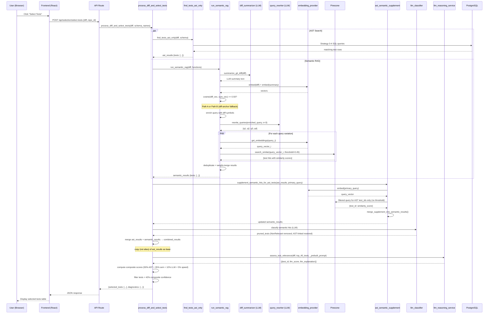

# Semantic Retrieval Flow — Complete Beginner-Friendly Guide

> **Reading time:** ~20 min  
> **Goal:** Understand exactly what happens after you click **"Select Tests"** — every stage, every fallback, every component, with plain-language examples.

---

## Table of Contents

1. [Big Picture — What Is Semantic Retrieval?](#1-big-picture)
2. [The Two Search Engines Working Together](#2-the-two-search-engines)
3. [Stage-by-Stage Walkthrough](#3-stage-by-stage-walkthrough)
   - [Stage 0 — User Clicks "Select Tests"](#stage-0--user-clicks-select-tests)
   - [Stage 1 — Parse the Git Diff](#stage-1--parse-the-git-diff)
   - [Stage 2 — AST Search (Structural)](#stage-2--ast-search-structural)
   - [Stage 3 — Semantic RAG Pipeline Starts](#stage-3--semantic-rag-pipeline-starts)
   - [Stage 4 — Build the Canonical Query Text](#stage-4--build-the-canonical-query-text)
   - [Stage 5 — Symbol Enrichment](#stage-5--symbol-enrichment)
   - [Stage 6 — Query Rewriting](#stage-6--query-rewriting)
   - [Stage 7 — Vector Search (Pinecone)](#stage-7--vector-search-pinecone)
   - [Stage 8 — AST–Semantic Supplement](#stage-8--astsemantic-supplement)
   - [Stage 9 — LLM Classifier (Pruning)](#stage-9--llm-classifier-pruning)
   - [Stage 10 — Merge AST + Semantic Results](#stage-10--merge-ast--semantic-results)
   - [Stage 11 — LLM Relevance Scoring](#stage-11--llm-relevance-scoring)
   - [Stage 12 — Confidence Filter & Final Output](#stage-12--confidence-filter--final-output)
4. [All Fallback Paths Explained](#4-all-fallback-paths-explained)
5. [Key Components & Files](#5-key-components--files)
6. [Configuration Knobs](#6-configuration-knobs)
7. [End-to-End Example](#7-end-to-end-example)
8. [Sequence Diagram](#8-sequence-diagram)

---

## 1. Big Picture

> **Simple analogy:** Imagine you have 1,000 test cases stored in a library. You changed some code. You need to find which tests in the library are relevant to your change. There are two librarians:
>
> - 🗂️ **Librarian A (AST)** — reads the exact file names, function names, and imports to find tests that *directly mention* the changed code.
> - 🧠 **Librarian B (Semantic/RAG)** — reads the *meaning* of your change and finds tests that test the same *behaviour*, even if they never use the exact same words.
>
> Both librarians work in parallel. Their results are merged. A third judge (LLM) then scores which of those tests are actually worth running.

---

## 2. The Two Search Engines

| | AST Search | Semantic (RAG) Search |
|---|---|---|
| **What it looks at** | File names, function names, import paths | Meaning / behaviour description |
| **How it works** | SQL queries on a structured test registry DB | Vector cosine similarity against Pinecone |
| **Strength** | Exact, zero false negatives for direct matches | Finds indirect / behavioural tests |
| **Weakness** | Misses tests with renamed/abstracted coverage | Can return vocabulary-overlap false positives |
| **Output** | `ast_results` dict | `semantic_results` dict |

Both run in parallel and are merged into `combined_results` before final scoring.

---

## 3. Stage-by-Stage Walkthrough

---

### Stage 0 — User Clicks "Select Tests"

**File:** `frontend/src/pages/RepositoryDetail.jsx`  
**API endpoint hit:** `POST /api/selection/select-tests`  
**File:** `backend/api/routes/selection.py`

The frontend collects:
- The selected repository ID
- The git diff (either pasted directly or fetched from GitHub/GitLab)
- Optional branch names

It then calls the backend. The backend entry point is:

```
process_diff_and_select_tests(diff_content, schema_name, ...)
```

**File:** `backend/git_diff_processor/process_diff_programmatic.py`

Everything from here on happens inside that single async function.

---

### Stage 1 — Parse the Git Diff

**File:** `backend/deterministic/parsing/diff_parser.py`

The raw diff text is parsed to extract:
- **Changed files** — e.g. `src/payments/invoice.py`
- **Changed functions** — e.g. `calculate_total`, `apply_discount`
- **Deleted symbols** — functions/classes that were removed
- **Added symbols** — new functions/classes
- **Renamed symbols** — old name → new name pairs
- **Test file candidates** — files that look like test files based on naming patterns

**Example diff input:**
```diff
--- a/src/payments/invoice.py
+++ b/src/payments/invoice.py
@@ -45,7 +45,9 @@
 def calculate_total(items):
-    return sum(item.price for item in items)
+    tax = sum(item.price for item in items) * 0.18
+    return sum(item.price for item in items) + tax
```

**What the parser extracts:**
```python
changed_functions = [{"name": "calculate_total", "file": "src/payments/invoice.py"}]
deleted_symbols   = []
added_symbols     = []
file_changes      = [{"path": "src/payments/invoice.py", "change_type": "modified"}]
```

---

### Stage 2 — AST Search (Structural)

**File:** `backend/git_diff_processor/selection_engine.py`  
Function: `find_tests_ast_only()`

This runs **5 strategies** against the PostgreSQL test registry database, in order:

| Strategy | What it searches | Example |
|---|---|---|
| **0 — Exact function call** | Tests that directly call `calculate_total` | `test_calculate_total_with_tax` |
| **1 — File name match** | Tests whose file path mentions `invoice.py` | `tests/payments/test_invoice.py` |
| **2 — Module match** | Tests that import `payments.invoice` | Any test with `from payments.invoice import ...` |
| **3 — Reverse index** | Pre-built map of which functions are called by which test | Anything in the reverse-index for `calculate_total` |
| **4 — File stem sibling** | Tests in the same folder whose name contains `invoice` | `test_invoice_formatting.py` |

Each found test gets `match_type = "ast"` and a confidence score.

**Output (`ast_results`):**
```python
{
  "tests": [
    {"test_id": 101, "method_name": "test_calculate_total_with_tax",
     "test_file_path": "tests/payments/test_invoice.py",
     "match_type": "ast", "confidence_score": 85},
    {"test_id": 102, "method_name": "test_invoice_discount",
     "test_file_path": "tests/payments/test_invoice.py",
     "match_type": "ast", "confidence_score": 70},
  ],
  "total_tests": 2,
  "match_details": { 101: [...], 102: [...] }
}
```

---

### Stage 3 — Semantic RAG Pipeline Starts

**File:** `backend/semantic/retrieval/rag_pipeline.py`  
Function: `run_semantic_rag()`

This runs **concurrently** with the AST search (they are both `await`ed and their results merged). The RAG pipeline has its own internal stages (4–7 below).

**Quick guard check first:** If there are no changed functions, no file changes, and no diff content at all, the pipeline immediately returns empty with diagnostic reason `"no_inputs"`.

---

### Stage 4 — Build the Canonical Query Text

This is the most important step. The pipeline needs a single **canonical string** that describes *what changed and why* — this string eventually becomes the search query sent to Pinecone.

> **Prerequisite:** `diff_content` must be non-empty. If it is missing or blank the pipeline returns `[]` immediately (stage: `"no_inputs"`). There is no metadata-only fallback.

There are **two possible sources** for this canonical text, tried in order:

---

#### Path A — LLM Diff Summary (preferred)

The full diff is sent to an LLM (Gemini / OpenAI / Ollama depending on config):

> *"Summarise this git diff in 2-3 sentences focusing on what code changed and what behaviour it affects."*

**File:** `backend/semantic/prompts/diff_summarizer.py`

**Example LLM summary:**
> *"The `calculate_total` function in `src/payments/invoice.py` now adds an 18% tax to the sum of item prices. This changes the return value from the raw subtotal to a tax-inclusive total."*

**Validation step (cosine check):**  
This summary is then embedded into a vector and compared against an embedding of the raw diff. If the cosine similarity ≥ **0.50** (the `GIT_DIFF_SUMMARY_VALIDATION_THRESHOLD`), the summary is trusted and used as the canonical query.

```
cosine(embed(diff), embed(summary)) >= 0.50  →  use summary  ✅
cosine(embed(diff), embed(summary)) <  0.50  →  summary drifted, use diff-anchor instead ⚠️
```

**Why this check?** LLMs sometimes hallucinate and produce summaries that don't actually describe the diff. If the summary doesn't semantically match the diff, using it would cause wrong tests to be retrieved.

---

#### Path B — Diff-Anchor Text (fallback when summary is rejected or fails)

**File:** `backend/semantic/retrieval/query_builder.py` → `build_diff_anchor_text()`

When the LLM summary is rejected or the LLM call fails, the system builds a structured text block directly from the raw diff, clipped to `RAG_DIFF_ANCHOR_MAX_CHARS` (default: 12,000 characters). This anchor includes the file paths, the changed lines, and a formatted description of the structural changes.

**Example anchor text:**
```
Modified: src/payments/invoice.py
Changed function: calculate_total
- return sum(item.price for item in items)
+ tax = sum(item.price for item in items) * 0.18
+ return sum(item.price for item in items) + tax
```

```
[Fallback cascade summary]
diff_content empty → ❌ abort (stage: "no_inputs")
diff_content present → Path A (LLM summary, validated) → Path B (diff anchor)
```

---

### Stage 5 — Symbol Enrichment

**File:** `backend/semantic/retrieval/query_builder.py` → `enrich_semantic_query_with_diff_symbols()`

The canonical query text is augmented with the symbol lists extracted in Stage 1:

```
[Original canonical text]
The calculate_total function now adds 18% tax to the item subtotal.

[Diff symbols]
Deleted: (none)
Added: (none)
Modified: calculate_total
File: src/payments/invoice.py
```

This ensures the vector search is anchored to the exact function names and file paths, not just the prose description. Even if the LLM summary is used, the symbol block is always appended.

---

### Stage 6 — Query Rewriting

**File:** `backend/semantic/prompts/query_rewriter.py`  
Class: `QueryRewriterService`

The enriched canonical query is sent to the LLM again, this time to produce **multiple rephrased versions** of the same query.
**Why?** A single query captures one angle of the change. Different phrasings catch different tests in the vector space:
- "Tests that validate tax calculation in invoice processing"
- "Tests for `calculate_total` that assert return values include tax"
- "Edge case tests for items with zero price in the invoice subtotal function"

The default is **3 variations** (set by `num_query_variations=3`). The original enriched query is always prepended as query #1.

**Result (4 total queries, original + 3):**
```python
queries = [
  "The calculate_total function in src/payments/invoice.py now adds 18% tax... [Diff symbols] ...",
  "Tests that validate tax calculation in invoice processing for calculate_total",
  "Tests for calculate_total that assert return values include tax",
  "Edge case tests for zero-price items in the invoice subtotal function",
]
```

**Robustness features in the rewriter:**
- The LLM must respond with valid JSON `{"variations": [...]}`.
- If the LLM wraps it in a markdown code fence (` ```json `), the parser strips it.
- If the JSON contains invalid backslash escapes (e.g. regex patterns), a repair function fixes them before parsing.
- 4 fallback JSON-extraction strategies (code fence → `"variations"` key → any `{...}` → raw content).

**Fallback when rewriting fails:**  
If the rewriter returns fewer than 2 queries, the pipeline checks the `RAG_LENIENT_FALLBACK` flag:
- **`RAG_LENIENT_FALLBACK=true` (default):** Run the search with just the single enriched original query and mark diagnostics with `"recovered_via": "RAG_LENIENT_FALLBACK"`.
- **`RAG_LENIENT_FALLBACK=false`:** Return empty results with stage `"rewrite"` in diagnostics.

---

### Stage 7 — Vector Search (Pinecone)

**File:** `backend/semantic/retrieval/rag_pipeline.py` → `_vector_search_queries()`  
**File:** `backend/semantic/backends/pinecone_backend.py`

Each of the 4 queries goes through this process:

#### Step 7a — Embed the query

The query string is converted into a **768-dimensional vector** (using nomic-embed-text / OpenAI / Gemini embeddings depending on config).

```
"Tests that validate tax calculation..."
         ↓ (embedding model)
[0.023, -0.145, 0.891, ..., 0.034]   ← 768 numbers
```

#### Step 7b — Search Pinecone

Pinecone receives the query vector and returns the stored test vectors with the highest **cosine similarity** score. Only tests with similarity ≥ **0.45** (the `DEFAULT_SIMILARITY_THRESHOLD`) are returned.

```
cosine(query_vector, test_vector) >= 0.45  →  returned ✅
cosine(query_vector, test_vector) <  0.45  →  filtered out ❌
```

**Why 0.45?** This threshold is a pragmatic noise floor — it removes tests that are almost certainly unrelated (similarity close to random). It does **not** cleanly separate vocabulary overlap from genuine semantic relevance; vocabulary-heavy tests (e.g. a test file named `test_invoice_processor.py` when the diff touches `invoice.py`) can score well above 0.45 purely from shared tokens. That is why the LLM classifier in Stage 9 exists as a second-pass filter: it prunes vocabulary-only false positives that clear the cosine threshold but have no structural or behavioural connection to the change.

#### Step 7c — Merge results from all 4 queries (deduplication + weighted ranking)

Tests returned by multiple query variations are **deduplicated** using an O(1) lookup dictionary (`seen: Dict[str, Dict]`). When the same test appears in multiple queries:
- Its `similarity` score is updated to the **maximum** across all queries it appeared in.
- Its `query_weight` is updated to the **maximum** weight (`1.0` for primary query, `0.9` for rewrites).

Then a `weighted_similarity = similarity × query_weight` is computed and used to **sort** the results. Tests found by the primary (original enriched) query rank slightly higher than those found only by rewrites.

**Example merge:**

| Test | Query 1 (weight 1.0) | Query 2 (weight 0.9) | Query 3 (weight 0.9) | Final |
|---|---|---|---|---|
| test_calculate_total_with_tax | sim=0.82 | sim=0.77 | — | weighted=0.82×1.0=**0.82** |
| test_invoice_zero_price | — | sim=0.61 | sim=0.68 | weighted=0.68×0.9=**0.61** |
| test_payment_gateway | — | sim=0.47 | — | weighted=0.47×0.9=**0.42** |

**Pinecone singleton:**  
The Pinecone client is **created once per process** and reused across all queries and all requests (thread-safe singleton). This prevents double-inidtialisation.

---

### Stage 8 — AST–Semantic Supplement

**File:** `backend/semantic/retrieval/ast_semantic_supplement.py`

**Problem this solves:**  
The AST search (Stage 2) may find tests that are strongly structural matches (same file, same function call). But those tests may have a similarity score of 0.38 against the RAG query — below the 0.45 threshold — so they never appear in the semantic results. In the UI they'd show `similarity: 0%`, which looks wrong and confuses the LLM scorer.

**What the supplement does:**  
After semantic search finishes, it takes **every test found by AST** and runs a **targeted Pinecone query** for those specific test IDs only (no global threshold). This gives each AST test its real cosine similarity score against the primary RAG query.

```
AST found: [test_101, test_102, test_105]
Supplement runs: embed(primary_query) → Pinecone filtered to {101, 102, 105}
Scores returned: {101: 0.78, 102: 0.41, 105: 0.35}
```

These scores are then **merged into `semantic_results`**:
- If a test is already in semantic results with a higher score → keep the higher score.
- If a test is in AST results but not in semantic results → add it with the supplement score.

> **Key benefit:** The LLM scorer (Stage 11) now sees real semantic evidence for every AST-matched test, not just zeros.

---

### Stage 9 — LLM Classifier (Pruning)

**File:** `backend/semantic/prompts/semantic_classify_prompt.py`

Before merging, a lightweight LLM classification pass runs over the semantic retrieval results to prune obvious false positives. Each test is labelled **Relevant** or **NonRelevant** based on its test name, file path, and the diff description.

**Important safety rule:**  
If a test is marked `NonRelevant` by the classifier but was **also found by AST**, it is **restored** to the candidate list. The reasoning: if the structural analysis found a direct link (same function call, same file), the LLM classifier's "NonRelevant" label is likely wrong (semantic false negative). AST evidence overrides semantic pruning.

```
Classifier says NonRelevant for test_102
BUT test_102 is in ast_results
→ test_102 is RESTORED to semantic_results ✅
```

---

### Stage 10 — Merge AST + Semantic Results

**File:** `backend/git_diff_processor/process_diff_programmatic.py`  
Around line 541.

`combined_results` starts as a **copy** (not alias!) of `ast_results`. Then for every test in `semantic_results`:

- **Already in combined:** Enrich it — add `semantic_similarity`, update `confidence_score`, mark `is_semantic = True`.
- **Not in combined:** Add it as a new entry with `match_type = "semantic"`.

This ensures:
- AST-matched tests always appear (they are the base)
- Semantic-only tests get added on top
- Tests found by both get enriched scores

The count shown in the merge log is **not additive**:

```
[MERGE] Single combined result set (not additive): AST base 8 test_id(s);
merging 15 semantic retrieval row(s) → 5 test_id(s) overlap AST (enriched),
10 test_id(s) semantic-only — final count is not 8+15.
```

Meaning: 5 tests were found by both → enriched; 10 were semantic-only → added; final set = 8 + 10 = **18 tests** (not 23).

---

### Stage 11 — LLM Relevance Scoring

**File:** `backend/services/llm_reasoning_service.py`  
Function: `assess_test_relevance()`

The top N tests (default: 40, configurable via `LLM_ASSESS_TOP_N`) are sent to the LLM with the diff and their match reasons. The LLM scores each test from **0.0 to 1.0** and provides an explanation.

**Example LLM prompt (simplified):**
```
You are analyzing production code changes.

## Git diff
--- a/src/payments/invoice.py
+++ b/src/payments/invoice.py
 def calculate_total(items):
-    return sum(item.price for item in items)
+    return sum(item.price for item in items) * 1.18

## Tests to score (18 total)
1. Test ID: 101 | Method: test_calculate_total_with_tax | File: tests/payments/test_invoice.py
   Match reasons: direct_function_call(calculate_total), same_file
2. Test ID: 102 | Method: test_invoice_discount | File: tests/payments/test_invoice.py
   Match reasons: same_file
...
```

**LLM scores returned:**
```python
{101: {"llm_score": 0.95, "llm_explanation": "Directly tests the function that changed"},
 102: {"llm_score": 0.70, "llm_explanation": "Regression guard — same file, different method"},
 103: {"llm_score": 0.20, "llm_explanation": "Only shares domain keyword, no structural link"}}
```

**Key LLM scoring rules (in system prompt):**
- Tests that **directly call or import** the changed code → score `0.90+`
- Tests in the **same file** guarding existing behaviour (regression guards) → score `0.70+`
- Tests with only vocabulary/domain overlap (e.g. both mention "invoice") → penalised → score `< 0.50`

**Performance feature (Bug 6 fix):**  
The relevance prompt is built **once** and passed into `assess_test_relevance` via `_prebuilt_prompt`. Previously it was built outside for diagnostics storage and then rebuilt internally — now it's built once and the same string is used everywhere.

---

### Stage 12 — Confidence Filter & Final Output

**File:** `backend/git_diff_processor/process_diff_programmatic.py`

Each test gets a **composite confidence score** combining:

| Source | Weight |
|---|---|
| AST structural match | 50% |
| Semantic (vector) similarity | 35% |
| LLM relevance score | 10% |
| Execution speed | 5% |

Tests below **42% composite confidence** are filtered out (configurable via `SELECTION_APPLY_CONFIDENCE_FILTER=false` to disable).

The final result is returned to the frontend as a JSON list of selected tests with their scores, explanations, and match breakdowns.

---

## 4. All Fallback Paths Explained

```
START
  │
  ▼
diff_content empty or missing?
  └── YES → Return [] immediately. Stage: "no_inputs"
  │
  ▼
LLM diff summary request
  ├── LLM returns summary AND cosine(diff, summary) >= 0.50 → Use LLM summary ✅
  ├── LLM returns summary BUT cosine < 0.50 → Use diff-anchor text (Path B) ⚠️
  ├── LLM summary is empty → Use diff-anchor text (Path B) ⚠️
  └── LLM call throws exception → Use diff-anchor text (Path B) ⚠️
  │
  ▼
Canonical text is empty after all paths?
  └── YES → Return [] immediately. Stage: "no_canonical_text"
  │
  ▼
Query rewriting (LLM call #2)
  ├── Returns 2+ queries → proceed normally ✅
  ├── Returns 1 query AND RAG_LENIENT_FALLBACK=true → Search with 1 query ⚠️
  │     diagnostic: "recovered_via": "RAG_LENIENT_FALLBACK"
  ├── Returns 1 query AND RAG_LENIENT_FALLBACK=false → Return [] ❌
  ├── All rewriter outputs empty after stripping → Return [] ❌
  └── Rewriter throws exception → Fall back to [original_query] ⚠️
  │
  ▼
Vector search (per query, Pinecone)
  ├── Query embedding fails → Log warning, skip that query, continue with others ⚠️
  └── All queries fail → all_results = [] → Return []
  │
  ▼
AST supplement step
  └── Any exception → Log warning, skip, continue with un-supplemented results ⚠️
  │
  ▼
LLM classifier (pruning)
  └── Any exception → Log warning, skip pruning, keep all semantic results ⚠️
  │
  ▼
LLM relevance scoring
  └── LLM provider unavailable / throws → Return [] for scores, tests still pass through ⚠️
  │
  ▼
Confidence filter
  └── SELECTION_APPLY_CONFIDENCE_FILTER=false → All tests pass, no filtering ⚠️
```

> **Design principle:** Every non-critical step has a `try/except` that logs and continues rather than crashing the whole request. Only complete absence of inputs causes an immediate abort.

---

## 5. Key Components & Files

| Component | File | Role |
|---|---|---|
| **API entry point** | `backend/api/routes/selection.py` | Receives HTTP request, validates schema names, returns JSON |
| **Main orchestrator** | `backend/git_diff_processor/process_diff_programmatic.py` | Runs AST + semantic in parallel, merges, filters |
| **Diff parser** | `backend/deterministic/parsing/diff_parser.py` | Extracts functions, symbols, file changes from raw diff |
| **AST search engine** | `backend/git_diff_processor/selection_engine.py` | 5-strategy SQL search against test registry |
| **RAG pipeline** | `backend/semantic/retrieval/rag_pipeline.py` | Canonical query → rewrite → vector search |
| **Diff summariser** | `backend/semantic/prompts/diff_summarizer.py` | LLM call to summarise the diff |
| **Validation** | `backend/semantic/retrieval/validation.py` | Cosine check on LLM summary vs raw diff |
| **Query builder** | `backend/semantic/retrieval/query_builder.py` | Builds anchor text, rich description, enriches with symbols |
| **Query rewriter** | `backend/semantic/prompts/query_rewriter.py` | LLM call to generate multiple query variations |
| **Pinecone backend** | `backend/semantic/backends/pinecone_backend.py` | Sends embedding vectors, retrieves similar tests |
| **Backend singleton** | `backend/semantic/backends/__init__.py` | Thread-safe singleton for Pinecone client |
| **AST–Sem supplement** | `backend/semantic/retrieval/ast_semantic_supplement.py` | Scores AST tests against RAG query without threshold |
| **LLM classifier** | `backend/semantic/prompts/semantic_classify_prompt.py` | Prunes obvious false positives before merge |
| **LLM scorer** | `backend/services/llm_reasoning_service.py` | Scores top-40 tests 0.0–1.0 with explanation |
| **Embedding text builder** | `backend/semantic/embedding_generation/text_builder.py` | Builds text stored in Pinecone when tests are indexed |
| **Config** | `backend/semantic/config.py` | All thresholds and feature flags |
| **Schema validator** | `backend/deterministic/db_connection.py` → `validate_schema_name()` | Prevents SQL injection via user-supplied schema names |

---

## 6. Configuration Knobs

| Env Variable | Default | Effect |
|---|---|---|
| `SEMANTIC_VECTOR_THRESHOLD` | `0.45` | Minimum cosine similarity for a test to be returned from Pinecone |
| `GIT_DIFF_SUMMARY_VALIDATION_THRESHOLD` | `0.50` | Minimum cosine match between diff and LLM summary to trust the summary |
| `RAG_LENIENT_FALLBACK` | `true` | Whether to search with 1 query if rewriter fails |
| `RAG_DIFF_ANCHOR_MAX_CHARS` | `12000` | Max chars of raw diff to use when building anchor text |
| `LLM_ASSESS_TOP_N` | `40` | How many tests to send to LLM relevance scorer |
| `USE_LLM_REASONING` | `true` | Toggle LLM scoring on/off entirely |
| `SELECTION_APPLY_CONFIDENCE_FILTER` | `true` | Toggle the 42% confidence gate on/off |
| `VECTOR_BACKEND` | `pinecone` | Vector backend (only `pinecone` supported) |
| `PINECONE_API_KEY` | — | Required: Pinecone authentication |
| `PINECONE_INDEX_NAME` | `test-embeddings` | Name of the Pinecone index holding test vectors |

---

## 7. End-to-End Example

**Scenario:** Developer changes the `calculate_total` function in `src/payments/invoice.py` to add 18% tax.

```
[User clicks "Select Tests"]
         │
         ▼
[Stage 1 — Parse diff]
  → changed_functions = [{name: "calculate_total", file: "src/payments/invoice.py"}]
  → deleted_symbols = []
  → added_symbols = []
         │
         ├─────────────────────────────────────────────┐
         ▼                                             ▼
[Stage 2 — AST Search]                  [Stage 3–7 — Semantic RAG]
  Strategy 0: direct call → test_101         Stage 4: LLM summary →
  Strategy 1: file match  → test_102           "calculate_total now adds 18% tax"
  Strategy 4: sibling     → test_105           cosine=0.71 ≥ 0.50 → use summary ✅
  ast_results: 3 tests                        Stage 5: append [Diff symbols] block
                                              Stage 6: rewrite → 4 queries
                                              Stage 7: Pinecone search each query
                                                query 1 → [test_101(0.82), test_103(0.61)]
                                                query 2 → [test_101(0.77), test_104(0.53)]
                                                query 3 → [test_104(0.58), test_105(0.49)]
                                                query 4 → [test_106(0.51)]
                                              After dedup+merge:
                                                test_101: weighted=0.82 (primary hit)
                                                test_103: weighted=0.55
                                                test_104: weighted=0.52
                                                test_105: weighted=0.44
                                                test_106: weighted=0.46
         │                                    semantic_results: 5 tests
         └─────────────────────────────────────────────┘
         │
         ▼
[Stage 8 — AST supplement]
  test_102 (AST only) gets supplement score: cosine=0.41
  → added to semantic_results with similarity=0.41, semantic_supplement_from_ast=True
         │
         ▼
[Stage 9 — LLM classifier]
  test_106 labelled NonRelevant (only shares "payment" keyword)
  test_106 NOT in ast_results → removed from semantic_results ❌
         │
         ▼
[Stage 10 — Merge]
  combined_results = copy of ast_results (test_101, test_102, test_105)
  + semantic-only additions: test_103, test_104
  test_101: enriched with semantic similarity 0.82
  test_102: enriched with supplement similarity 0.41
  test_105: enriched with supplement similarity 0.49
  Final combined: 5 tests
         │
         ▼
[Stage 11 — LLM scoring]
  test_101: llm_score=0.95 "Directly tests changed function"
  test_102: llm_score=0.72 "Regression guard — same file"
  test_103: llm_score=0.65 "Tests invoice total calculation path"
  test_104: llm_score=0.58 "Edge case for zero-price items"
  test_105: llm_score=0.40 "Sibling file, indirect coverage"
         │
         ▼
[Stage 12 — Composite score & filter]
  test_101: 85(ast)×0.5 + 82(sem)×0.35 + 95(llm)×0.1 + 5(speed)×0.05 = 76.8 ✅
  test_102: 70×0.5 + 41×0.35 + 72×0.1 = 57.7 ✅
  test_103: 0×0.5 + 61×0.35 + 65×0.1 = 27.9 ❌ (below 42% gate — dropped)
  test_104: 0×0.5 + 52×0.35 + 58×0.1 = 24.0 ❌ (below 42% gate — dropped)
  test_105: 60×0.5 + 49×0.35 + 40×0.1 = 51.2 ✅
         │
         ▼
[Final output to UI: 3 tests selected]
  ✅ test_calculate_total_with_tax   (score 77, ast+semantic+llm)
  ✅ test_invoice_discount           (score 58, ast+supplement)
  ✅ test_invoice_zero_price_sibling (score 51, ast+supplement)
```

---

## 8. Sequence Diagram



---

*Generated from live codebase traversal — `backend/semantic/retrieval/rag_pipeline.py`, `backend/git_diff_processor/process_diff_programmatic.py`, `backend/semantic/prompts/query_rewriter.py`, `backend/semantic/retrieval/ast_semantic_supplement.py`, `backend/services/llm_reasoning_service.py`, `backend/semantic/config.py`, `backend/semantic/backends/__init__.py`*
