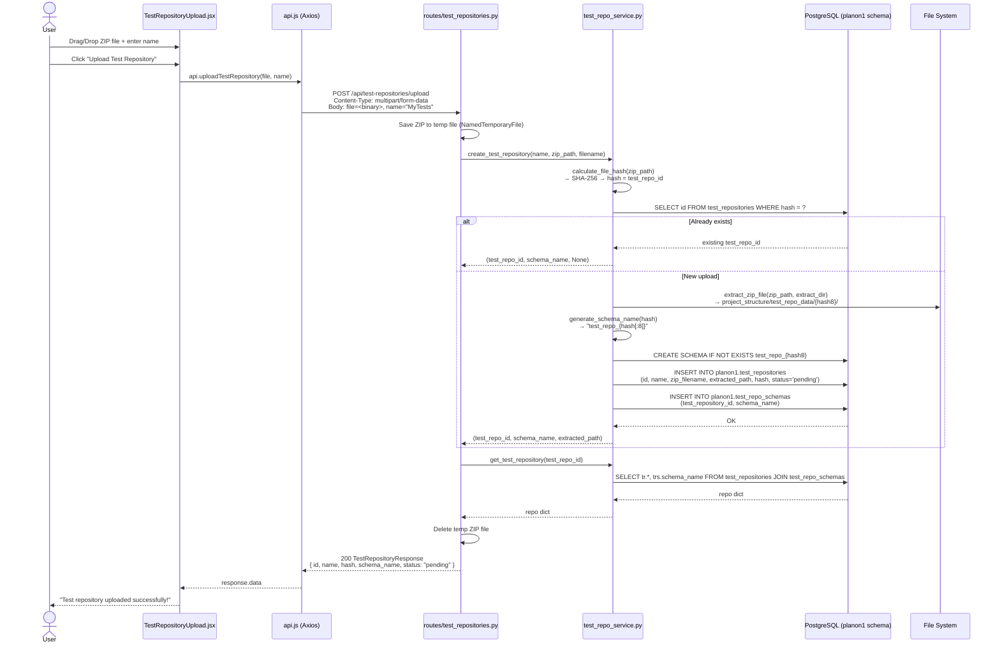
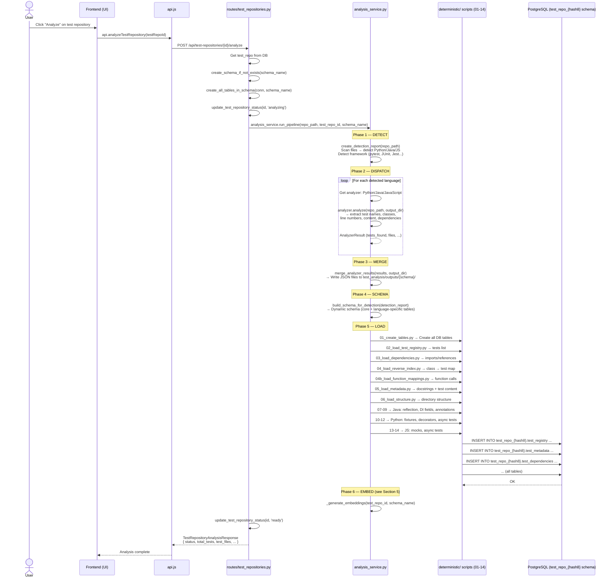
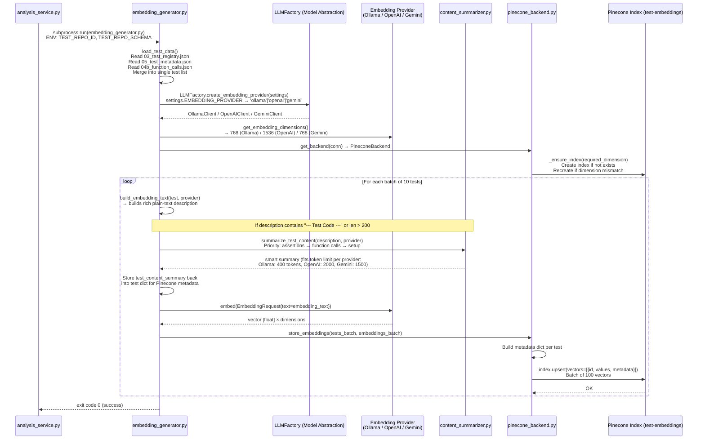

# Test Repository Pipeline: From Upload to Pinecone

## Overview

This document describes the complete technical flow of how a test repository (uploaded as a ZIP file) is processed through the platform — from the UI upload, through the analysis pipeline, into the PostgreSQL database, and finally into Pinecone as vector embeddings for semantic search.

---

## Table of Contents

1. [System Architecture Overview](#1-system-architecture-overview)
2. [Technology Stack](#2-technology-stack)
3. [Step-by-Step Flow: Upload Test Repository](#3-step-by-step-flow-upload-test-repository)
4. [Step-by-Step Flow: Run Analysis Pipeline](#4-step-by-step-flow-run-analysis-pipeline)
5. [Step-by-Step Flow: Generate & Store Embeddings in Pinecone](#5-step-by-step-flow-generate--store-embeddings-in-pinecone)
6. [Data Models](#6-data-models)
7. [Database Schema](#7-database-schema)
8. [Environment Configuration](#8-environment-configuration)
9. [Error Handling](#9-error-handling)
10. [Key Files Reference](#10-key-files-reference)

---

## 1. System Architecture Overview

```mermaid
graph TB
    subgraph Frontend ["Frontend (React + Vite)"]
        TRU[TestRepositoryUpload.jsx<br/>Drag-and-drop ZIP Upload]
        MTR[ManageTestRepositories.jsx<br/>List & Manage Repos]
        API_JS[api.js<br/>Axios HTTP Client]
    end

    subgraph Backend ["Backend (FastAPI - Python)"]
        TR_ROUTES[routes/test_repositories.py<br/>REST API Endpoints]
        TR_SVC[services/test_repo_service.py<br/>ZIP Extraction + Schema + DB]
        AN_SVC[services/analysis_service.py<br/>6-Phase Analysis Pipeline]
        EMB_GEN[semantic/embedding_generator.py<br/>Embedding Generation]
    end

    subgraph AnalysisPipeline ["Analysis Pipeline (Deterministic Scripts)"]
        DET[Phase 1: DETECT<br/>Language & Framework Detection]
        DISP[Phase 2: DISPATCH<br/>Python / Java / JS Analyzers]
        MERGE[Phase 3: MERGE<br/>Combine Analyzer Results]
        SCHEMA[Phase 4: SCHEMA<br/>Build Dynamic DB Schema]
        LOAD[Phase 5: LOAD<br/>deterministic/01-14 scripts]
        EMBED[Phase 6: EMBED<br/>embedding_generator.py]
    end

    subgraph Database ["PostgreSQL Database"]
        MAIN_SCHEMA[planon1 schema<br/>test_repositories<br/>test_repo_schemas<br/>repository_test_bindings]
        REPO_SCHEMA[test_repo_{hash8} schema<br/>test_registry<br/>test_metadata<br/>test_dependencies<br/>reverse_index<br/>test_function_mapping<br/>test_structure]
    end

    subgraph VectorDB ["Pinecone Vector Database"]
        PC_INDEX[Index: test-embeddings<br/>768-dim cosine vectors<br/>Metadata: test_id, method_name,<br/>description, test_repo_id, ...]
    end

    subgraph LLM ["Model Abstraction Layer (LLMFactory)"]
        OLLAMA[Ollama<br/>nomic-embed-text<br/>768-dim]
        OPENAI[OpenAI<br/>text-embedding-ada-002<br/>1536-dim]
        GEMINI[Gemini<br/>embedding-001<br/>768-dim]
    end

    TRU -->|POST /api/test-repositories/upload<br/>multipart/form-data| API_JS
    API_JS -->|HTTP| TR_ROUTES
    TR_ROUTES --> TR_SVC
    TR_SVC -->|INSERT| MAIN_SCHEMA
    TR_ROUTES -->|POST /{id}/analyze| AN_SVC
    AN_SVC --> DET
    DET --> DISP
    DISP --> MERGE
    MERGE --> SCHEMA
    SCHEMA --> LOAD
    LOAD -->|INSERT| REPO_SCHEMA
    LOAD --> EMBED
    EMBED --> LLM
    LLM -->|embedding vectors| EMB_GEN
    EMB_GEN -->|upsert| PC_INDEX
```

---

## 2. Technology Stack

| Layer | Technology | Purpose |
|-------|-----------|---------|
| Frontend | React 18, Vite | UI framework and build tool |
| HTTP Client | Axios | REST API calls from browser |
| File Upload | `multipart/form-data` | Streaming ZIP file upload |
| Backend Framework | FastAPI (Python) | Async REST API server |
| ZIP Handling | Python `zipfile` | Extract test source files from ZIP |
| Hash Identification | SHA-256 (`hashlib`) | Unique ID + deduplication of uploads |
| Database | PostgreSQL (psycopg2) | Test repo metadata + analysis results |
| Schema Isolation | PostgreSQL Schemas | Each test repo gets its own schema (`test_repo_{hash8}`) |
| Language Detection | Custom detector + Tree-sitter | Identify Python / Java / JavaScript files |
| Code Analysis | AST (Python), Regex (Java/JS) | Extract test names, content, dependencies |
| Model Abstraction | LLMFactory | Swap embedding providers (Ollama/OpenAI/Gemini) |
| Embeddings (default) | Ollama `nomic-embed-text` | 768-dimensional text embeddings |
| Vector Database | Pinecone (Serverless) | Store & query test embeddings |
| Content Summarization | `content_summarizer.py` | Smart summarization of test code for embeddings |
| Environment Config | python-dotenv | Loading `.env` file variables |

---

## 3. Step-by-Step Flow: Upload Test Repository

### Architecture Flow



### Internal Logic Details

#### SHA-256 Deduplication
```
ZIP file bytes → SHA-256 hash → 64-char hexadecimal string
hash[:8]       → "a1b2c3d4"
test_repo_id   → full 64-char hash (e.g. "a1b2c3d4e5f6...64chars")
schema_name    → "test_repo_a1b2c3d4"
extract_dir    → project_structure/test_repo_data/a1b2c3d4/
```

If the **same ZIP file** is uploaded again → same hash → `ON CONFLICT DO NOTHING` → no duplicate created.

#### Extraction Layout
```
project_structure/
  test_repo_data/
    a1b2c3d4/              ← named after hash[:8]
      MyProject/            ← first directory inside ZIP
        src/
          tests/
            test_login.py
            test_cart.py
```

#### Database Records Created (planon1 schema)

| Table | What is inserted |
|-------|-----------------|
| `planon1.test_repositories` | id (hash), name, zip_filename, extracted_path, hash, status='pending' |
| `planon1.test_repo_schemas` | test_repository_id, schema_name ("test_repo_{hash8}") |

---

## 4. Step-by-Step Flow: Run Analysis Pipeline

### Architecture Flow



### Analysis Pipeline Details

#### Phase 1 — DETECT
- Scans all files in the extracted path
- Identifies languages: Python, Java, JavaScript/TypeScript
- Detects test frameworks: `pytest`, `unittest`, `JUnit`, `TestNG`, `Jest`, `Mocha`
- Outputs: `01_test_files.json`, `02_framework_detection.json`

#### Phase 2 — DISPATCH: Language Analyzers

| Language | Analyzer Class | Technique | What it Extracts |
|----------|---------------|-----------|-----------------|
| Python | `PythonAnalyzer` | AST parsing | Test function names, docstrings, test body content, fixtures, decorators |
| Java | `JavaAnalyzer` | Regex parsing | `@Test` methods, class names, annotations, DI fields, reflection calls |
| JavaScript/TypeScript | `JavaScriptAnalyzer` | Regex + line-based | `describe/it/test()` blocks, arrow functions, async tests, mocks |
| Other | `TreeSitterFallbackAnalyzer` | Tree-sitter generic | Best-effort extraction for unsupported languages |

#### Phase 5 — LOAD: Deterministic Scripts

Each script reads JSON output files from the analyzer and loads into PostgreSQL:

| Script | Table Loaded | Data |
|--------|-------------|------|
| `01_create_tables.py` | _(creates schema)_ | Creates all tables in the test repo schema |
| `02_load_test_registry.py` | `test_registry` | test_id, method_name, class_name, file_path, language |
| `03_load_dependencies.py` | `test_dependencies` | imported classes per test |
| `04_load_reverse_index.py` | `reverse_index` | production class → test list |
| `04b_load_function_mappings.py` | `test_function_mapping` | module + function name per test |
| `05_load_metadata.py` | `test_metadata` | description (docstring + test content), markers, is_async |
| `06_load_structure.py` | `test_structure` | category, directory_path, test_count |
| `07-09` | Java-specific tables | reflection calls, DI fields, annotations |
| `10-12` | Python-specific tables | fixtures, decorators, async tests |
| `13-14` | JS-specific tables | mocks, async tests |

#### Output JSON Files (test_analysis/outputs/{schema_name}/)

```
03_test_registry.json       ← test_id, method_name, class_name, file_path, line_number
04b_function_calls.json     ← test_id → functions_tested (module + function name)
05_test_metadata.json       ← test_id → description (docstring + "--- Test Code ---" + body)
08_summary_report.json      ← statistics summary
```

---

## 5. Step-by-Step Flow: Generate & Store Embeddings in Pinecone

### Architecture Flow



### Embedding Text Construction (`build_embedding_text`)

For each test, a rich plain-text description is built to maximize semantic search precision:

```
Test: login with valid credentials         ← from method_name (cleaned)
Component: AuthService                     ← from class_name (cleaned)
Test code: asserts response.status==200,   ← smart summary of test body
           calls login_user(), checks token
Module under test: auth.service            ← from file_path
Tests functions: auth.login_user,          ← from function mappings (production calls)
                 auth.validate_token
Test type: integration
Markers: smoke, regression
Async test
```

### Smart Content Summarization (`content_summarizer.py`)

Test body content is summarized by **priority**:

| Priority | What is Extracted | Why |
|----------|------------------|-----|
| 1st | **Assertions** (`assert`, `assertEquals`, `expect`) | The "what" of the test |
| 2nd | **Function calls** (non-framework calls) | The "how" of the test |
| 3rd | **Setup code** (first lines of body) | The "context" of the test |

Token limits per provider to stay within embedding context window:

| Provider | Token Limit | Approx Chars |
|----------|------------|--------------|
| Ollama | 400 | ~1,600 chars |
| OpenAI | 2,000 | ~8,000 chars |
| Gemini | 1,500 | ~6,000 chars |

### Pinecone Vector Structure

Each test becomes **one vector** in Pinecone:

```json
{
  "id": "{test_repo_id}_{test_id}",
  "values": [0.123, -0.456, ...],
  "metadata": {
    "test_id": "test_login_user_001",
    "method_name": "test_login_with_valid_credentials",
    "class_name": "TestAuthService",
    "test_file_path": "tests/auth/test_auth_service.py",
    "test_type": "integration",
    "description": "asserts response.status==200, calls login_user()...",
    "line_number": "42",
    "language": "python",
    "is_async": "false",
    "markers": "smoke,regression",
    "module": "tests.auth.test_auth_service",
    "test_repo_id": "a1b2c3d4e5f6..."
  }
}
```

**Key design decisions:**
- `id` = `{test_repo_id}_{test_id}` → prevents overwriting tests from different repositories
- `description` = smart summary (max 1000 chars) → richer than just a docstring
- `test_repo_id` in metadata → enables filtering search by repository

### Model Abstraction Layer (LLMFactory)

The system can switch embedding providers without changing any other code:

```
.env: EMBEDDING_PROVIDER=ollama   → OllamaClient  → nomic-embed-text → 768-dim
.env: EMBEDDING_PROVIDER=openai   → OpenAIClient  → text-embedding-ada-002 → 1536-dim
.env: EMBEDDING_PROVIDER=gemini   → GeminiClient  → embedding-001 → 768-dim
```

`LLMFactory.create_embedding_provider(settings)` reads `EMBEDDING_PROVIDER` and returns the correct client. Pinecone index is **automatically recreated** if dimension changes (with warning).

---

## 6. Data Models

### Request Models

#### Upload (multipart/form-data — NOT JSON)
```
POST /api/test-repositories/upload
Content-Type: multipart/form-data

file: <binary ZIP data>
name: "MyTestRepository"
```

### Response Models

#### `TestRepositoryResponse` (Pydantic - `api/models/test_repository.py`)
```python
class TestRepositoryResponse(BaseModel):
    id: str                              # SHA-256 hash of ZIP file (64 chars)
    name: str                            # User-provided name
    zip_filename: Optional[str]          # Original ZIP filename
    extracted_path: str                  # Absolute path to extracted files
    hash: str                            # SHA-256 hash (same as id)
    uploaded_at: Optional[datetime]      # Upload timestamp
    last_analyzed_at: Optional[datetime] # Last analysis timestamp
    status: str                          # "pending" | "analyzing" | "ready" | "error"
    metadata: Optional[Dict]             # Extra metadata (JSON)
    schema_name: Optional[str]           # PostgreSQL schema "test_repo_{hash8}"
    bound_repositories: Optional[List[str]]  # List of code repo IDs bound to this
```

#### `TestRepositoryAnalysisResponse` (Pydantic - `api/models/test_repository.py`)
```python
class TestRepositoryAnalysisResponse(BaseModel):
    status: str                  # "completed"
    test_repository_id: str      # test repo ID
    schema_name: str             # PostgreSQL schema name
    files_analyzed: int          # Total files processed
    test_files: int              # Files containing tests
    total_tests: int             # Total tests discovered
    message: Optional[str]       # "Analysis completed successfully"
```

---

## 7. Database Schema

### `planon1` (Main Management Schema)

#### `planon1.test_repositories` Table

```sql
CREATE TABLE IF NOT EXISTS planon1.test_repositories (
    id              VARCHAR(64)  PRIMARY KEY,           -- SHA-256 hash of ZIP
    name            VARCHAR(255) NOT NULL,              -- User-given name
    zip_filename    VARCHAR(255),                       -- Original ZIP filename
    extracted_path  TEXT         NOT NULL,              -- Path to extracted directory
    hash            VARCHAR(64)  NOT NULL UNIQUE,       -- SHA-256 (same as id)
    uploaded_at     TIMESTAMP    DEFAULT CURRENT_TIMESTAMP,
    last_analyzed_at TIMESTAMP,                         -- Set when analysis completes
    status          VARCHAR(50)  DEFAULT 'pending',     -- pending|analyzing|ready|error
    metadata        JSONB,                              -- Optional extra metadata
    created_at      TIMESTAMP    DEFAULT CURRENT_TIMESTAMP
);

-- Indexes
CREATE INDEX idx_test_repositories_hash   ON planon1.test_repositories(hash);
CREATE INDEX idx_test_repositories_status ON planon1.test_repositories(status);
CREATE INDEX idx_test_repositories_name   ON planon1.test_repositories(name);
```

#### `planon1.test_repo_schemas` Table

```sql
CREATE TABLE IF NOT EXISTS planon1.test_repo_schemas (
    test_repository_id VARCHAR(64) PRIMARY KEY,         -- FK → test_repositories.id
    schema_name        VARCHAR(63) NOT NULL UNIQUE,     -- "test_repo_{hash8}"
    created_at         TIMESTAMP DEFAULT CURRENT_TIMESTAMP,
    FOREIGN KEY (test_repository_id) REFERENCES planon1.test_repositories(id) ON DELETE CASCADE
);
```

#### `planon1.repository_test_bindings` Table

```sql
CREATE TABLE IF NOT EXISTS planon1.repository_test_bindings (
    repository_id      VARCHAR(50) NOT NULL,            -- FK → planon1.repositories.id
    test_repository_id VARCHAR(64) NOT NULL,            -- FK → test_repositories.id
    is_primary         BOOLEAN     DEFAULT FALSE,       -- Primary test repo for a repo
    created_at         TIMESTAMP   DEFAULT CURRENT_TIMESTAMP,
    PRIMARY KEY (repository_id, test_repository_id)
);
```

### `test_repo_{hash8}` (Per-Repo Analysis Schema)

Each test repository gets its own isolated schema. Core tables:

```sql
-- Tests discovered
CREATE TABLE test_repo_a1b2c3d4.test_registry (
    test_id     VARCHAR(255) PRIMARY KEY,
    method_name VARCHAR(255),
    class_name  VARCHAR(255),
    file_path   TEXT,
    test_type   VARCHAR(50),    -- 'unit' | 'integration' | 'e2e'
    line_number INTEGER,
    language    VARCHAR(50)     -- 'python' | 'java' | 'javascript'
);

-- Test descriptions and content
CREATE TABLE test_repo_a1b2c3d4.test_metadata (
    test_id         VARCHAR(255) PRIMARY KEY,
    description     TEXT,       -- docstring + "--- Test Code ---" + body
    markers         JSONB,      -- pytest markers, JUnit categories
    is_async        BOOLEAN,
    is_parameterized BOOLEAN
);

-- Production classes imported/referenced by each test
CREATE TABLE test_repo_a1b2c3d4.test_dependencies (
    test_id          VARCHAR(255),
    referenced_class VARCHAR(255)
);

-- Production class → tests that cover it (inverted index)
CREATE TABLE test_repo_a1b2c3d4.reverse_index (
    production_class VARCHAR(255),
    test_id          VARCHAR(255),
    reference_type   VARCHAR(50)
);

-- Production functions called by each test
CREATE TABLE test_repo_a1b2c3d4.test_function_mapping (
    test_id       VARCHAR(255),
    module_name   VARCHAR(255),
    function_name VARCHAR(255)
);

-- Directory/category structure of the test repo
CREATE TABLE test_repo_a1b2c3d4.test_structure (
    category       VARCHAR(255),
    directory_path TEXT,
    test_count     INTEGER
);
```

### Schema Notes
- Each upload gets a **fully isolated schema** — no tables are shared between test repositories
- Schema name = `test_repo_{first 8 chars of SHA-256 hash}` (max 63 chars — PostgreSQL limit)
- `ON CONFLICT (hash) DO NOTHING` ensures re-uploading the same ZIP is idempotent
- Deleting a test repository drops its entire schema with `DROP SCHEMA ... CASCADE`

---

## 8. Environment Configuration

All sensitive credentials and configuration are stored in `.env` at the project root:

```env
# Embedding Provider (choose one)
EMBEDDING_PROVIDER=ollama         # 'ollama' | 'openai' | 'gemini'

# Ollama (local - default)
OLLAMA_BASE_URL=http://localhost:11434
OLLAMA_EMBEDDING_MODEL=nomic-embed-text

# OpenAI (cloud)
OPENAI_API_KEY=sk-your_key_here
OPENAI_EMBEDDING_MODEL=text-embedding-ada-002

# Gemini (cloud)
GEMINI_API_KEY=your_key_here

# Pinecone (vector database)
VECTOR_BACKEND=pinecone
PINECONE_API_KEY=your_pinecone_key
PINECONE_INDEX_NAME=test-embeddings
PINECONE_ENVIRONMENT=us-east-1    # AWS region for serverless

# PostgreSQL
DB_HOST=localhost
DB_PORT=5432
DB_NAME=your_database
DB_USER=your_user
DB_PASSWORD=your_password
DB_SCHEMA=planon1

# CORS (comma-separated origins)
CORS_ORIGINS=http://localhost:3000,http://127.0.0.1:3000
```

### Embedding Provider Dimensions

| Provider | Model | Dimensions | Use Case |
|----------|-------|-----------|---------|
| Ollama | `nomic-embed-text` | 768 | Local / no API cost |
| OpenAI | `text-embedding-ada-002` | 1536 | High accuracy cloud |
| Gemini | `embedding-001` | 768 | Google Cloud |

> ⚠️ **Important:** Changing `EMBEDDING_PROVIDER` after embeddings are already stored will cause a dimension mismatch. The system **auto-detects** this and will recreate the Pinecone index (deleting all existing vectors) before re-embedding.

---

## 9. Error Handling

### HTTP Status Codes

| Scenario | HTTP Status | Response |
|----------|------------|---------|
| Non-ZIP file uploaded | 400 (frontend) | UI error: "Please upload a ZIP file" |
| Missing name or file | 400 | `{ "detail": "..." }` |
| Test repo not found | 404 | `{ "detail": "Test repository not found" }` |
| Analysis output files missing | 400 | `{ "detail": "Analysis output files not found. Please run analysis first..." }` |
| No schema for test repo | 400 | `{ "detail": "Test repository has no schema. Please run analysis first." }` |
| Embedding generation failed | 500 | `{ "detail": "Embedding generation failed (exit code N). Check server logs." }` |
| Embedding timeout (>30 min) | 500 | `{ "detail": "Embedding generation timed out after 30 minutes" }` |
| No embeddings stored | 200 (warning) | `{ "status": "completed_with_warnings", "message": "No embeddings were stored..." }` |

### Analysis Pipeline Status Flow

```
Upload ZIP      → status = "pending"
Click Analyze   → status = "analyzing"
Analysis done   → status = "ready"
Any failure     → status = "error"
```

### Pinecone Dimension Mismatch Handling

```
Scenario: Switching from Ollama (768-dim) to OpenAI (1536-dim)

1. embedding_generator.py starts
2. Calls llm.get_embedding_dimensions() → 1536
3. Checks Pinecone index dimension → 768
4. MISMATCH DETECTED:
   a. Logs warning (N existing vectors will be deleted)
   b. Deletes Pinecone index
   c. Recreates with dimension 1536
   d. Proceeds with embedding generation
```

### Duplicate Upload Handling

```
Same ZIP uploaded twice:
1. calculate_file_hash(zip) → same SHA-256
2. SELECT FROM test_repositories WHERE hash = ?  → found
3. Return existing test_repo_id immediately
4. No duplicate extraction, no duplicate DB records
```

---

## 10. Key Files Reference

| File | Role |
|------|------|
| `web_platform/api/routes/test_repositories.py` | All test repository API endpoints: upload, analyze, list, delete, bind, regenerate-embeddings |
| `web_platform/api/models/test_repository.py` | Pydantic request/response models |
| `web_platform/services/test_repo_service.py` | ZIP extraction, SHA-256 hashing, schema creation, PostgreSQL CRUD |
| `web_platform/services/analysis_service.py` | Orchestrates 6-phase analysis pipeline; runs deterministic scripts; triggers embedding generation |
| `semantic/embedding_generator.py` | Loads JSON analysis output, builds embedding text, calls LLMFactory, stores in Pinecone |
| `semantic/backends/pinecone_backend.py` | Pinecone client: create/ensure index, upsert vectors, delete by repo, handle dimension mismatch |
| `semantic/utils/content_summarizer.py` | Smart test content summarization (priority: assertions → function calls → setup) |
| `semantic/config.py` | Constants: EMBEDDING_DIMENSIONS, BATCH_SIZE, PINECONE_DESCRIPTION_MAX_CHARS, token limits |
| `llm/factory.py` | LLMFactory: creates embedding provider from settings (Ollama / OpenAI / Gemini) |
| `config/settings.py` | Reads `.env` file, exposes EMBEDDING_PROVIDER, PINECONE_API_KEY, etc. |
| `test_analysis/core/analyzers/python_analyzer.py` | AST-based Python test extraction: names, docstrings, test body content |
| `test_analysis/core/analyzers/java_analyzer.py` | Regex-based Java test extraction: @Test methods, annotations, DI fields |
| `test_analysis/core/analyzers/javascript_analyzer.py` | Line-based JS/TS extraction: describe/it/test blocks, async, mocks |
| `deterministic/01_create_tables.py` | Creates all tables in a given schema |
| `deterministic/05_load_metadata.py` | Loads test descriptions (docstring + test code content) into `test_metadata` table |
| `web_platform/frontend/src/components/TestRepositoryUpload.jsx` | UI: drag-and-drop ZIP upload form |
| `web_platform/frontend/src/pages/ManageTestRepositories.jsx` | UI: list, analyze, delete test repositories |
| `web_platform/frontend/src/services/api.js` | Axios HTTP client: `uploadTestRepository`, `analyzeTestRepository`, `regenerateEmbeddings` |
| `deterministic/db_connection.py` | PostgreSQL connection pool, `DB_SCHEMA`, `create_schema_if_not_exists` |
| `project_structure/test_repo_data/` | File system storage for extracted ZIP contents |
| `test_analysis/outputs/{schema_name}/` | JSON output files from analyzers (input to DB loaders + embedding generator) |

---

## Appendix: API Endpoints Summary

| Method | Endpoint | Description | File |
|--------|---------|-------------|------|
| `POST` | `/api/test-repositories/upload` | Upload ZIP file as test repository | `routes/test_repositories.py:upload_test_repository` |
| `GET` | `/api/test-repositories` | List all test repositories | `routes/test_repositories.py:list_all_test_repositories` |
| `GET` | `/api/test-repositories/{id}` | Get test repository by ID | `routes/test_repositories.py:get_test_repo` |
| `DELETE` | `/api/test-repositories/{id}` | Delete test repository + schema + files | `routes/test_repositories.py:delete_test_repo` |
| `POST` | `/api/test-repositories/{id}/analyze` | Run full 6-phase analysis pipeline | `routes/test_repositories.py:analyze_test_repository` |
| `GET` | `/api/test-repositories/{id}/analysis` | Get analysis results from DB + JSON | `routes/test_repositories.py:get_test_repository_analysis` |
| `POST` | `/api/test-repositories/{id}/regenerate-embeddings` | Re-run only embedding generation (skip analysis) | `routes/test_repositories.py:regenerate_embeddings` |
| `POST` | `/api/test-repositories/repositories/{repo_id}/bind-test-repo` | Bind test repo to code repo | `routes/test_repositories.py:bind_test_repo_to_repo` |
| `DELETE` | `/api/test-repositories/repositories/{repo_id}/unbind-test-repo/{test_repo_id}` | Unbind test repo from code repo | `routes/test_repositories.py:unbind_test_repo_from_repo` |
| `GET` | `/api/test-repositories/repositories/{repo_id}/test-repositories` | List test repos bound to a code repo | `routes/test_repositories.py:get_repo_test_repositories` |
| `PUT` | `/api/test-repositories/repositories/{repo_id}/primary-test-repo/{test_repo_id}` | Set primary test repository | `routes/test_repositories.py:set_primary_test_repo` |
