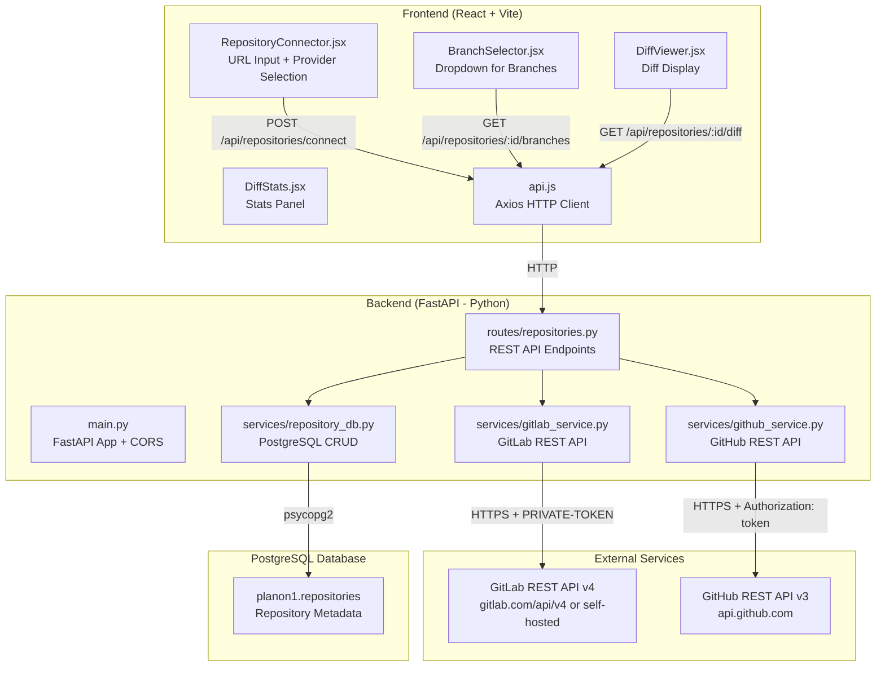
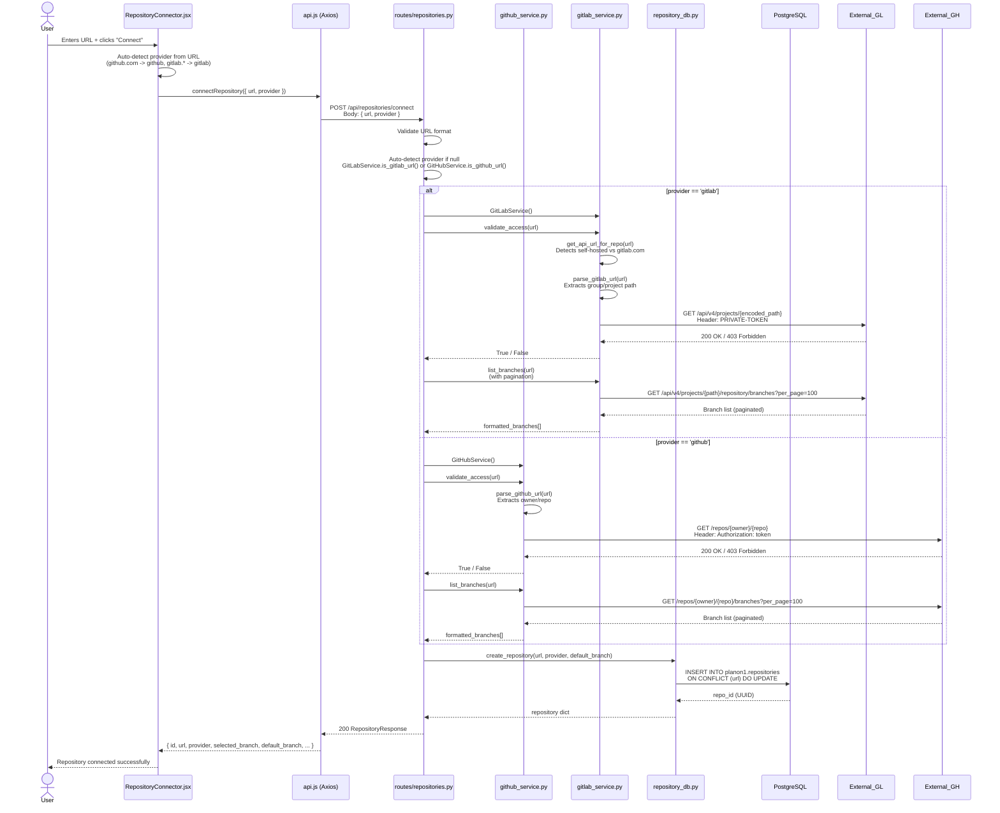
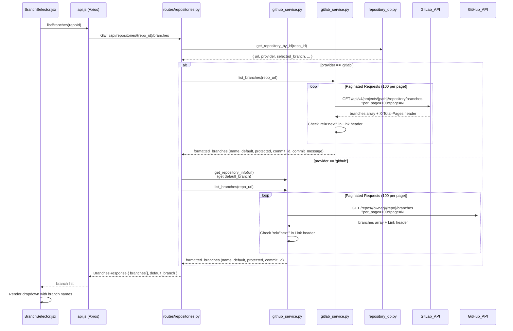
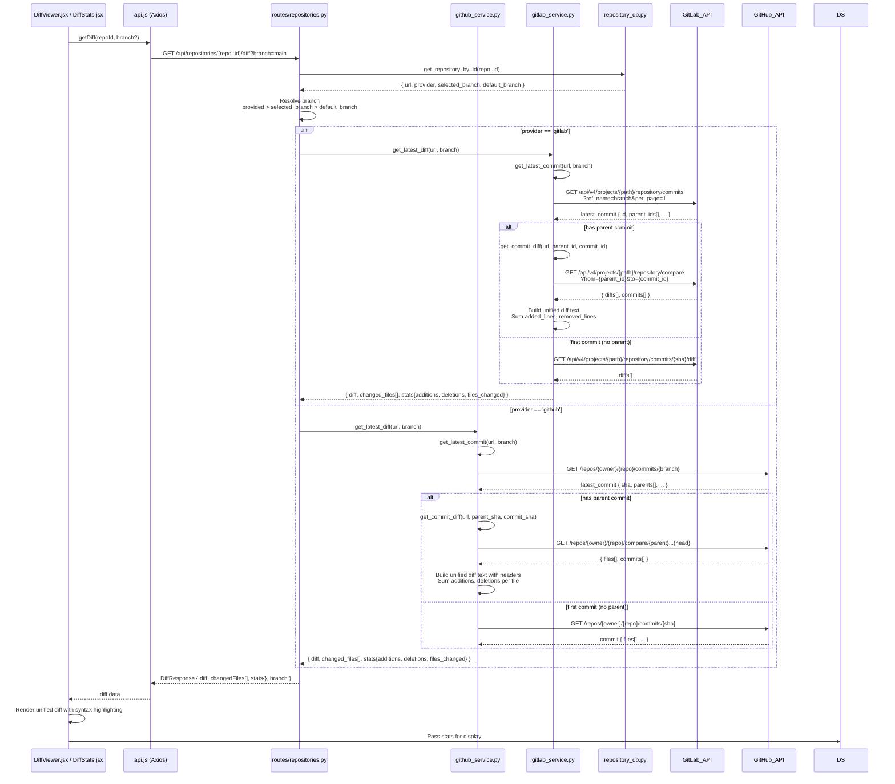

# Repository Integration: From URL to Diff

## Overview

This document describes the complete technical flow of how a GitHub or GitLab repository URL is submitted through the platform, how branches are listed, and how the git diff is fetched and displayed. It includes architecture diagrams, file references, API contracts, and the internal logic at each step.

---

## Table of Contents

1. [System Architecture Overview](#1-system-architecture-overview)
2. [Technology Stack](#2-technology-stack)
3. [Step-by-Step Flow: Connect a Repository](#3-step-by-step-flow-connect-a-repository)
4. [Step-by-Step Flow: List Branches](#4-step-by-step-flow-list-branches)
5. [Step-by-Step Flow: Fetch Git Diff](#5-step-by-step-flow-fetch-git-diff)
6. [Data Models](#6-data-models)
7. [Database Schema](#7-database-schema)
8. [Environment Configuration](#8-environment-configuration)
9. [Error Handling](#9-error-handling)
10. [Key Files Reference](#10-key-files-reference)

---

## 1. System Architecture Overview



---

## 2. Technology Stack

| Layer | Technology | Purpose |
|-------|-----------|---------|
| Frontend | React 18, Vite | UI framework and build tool |
| HTTP Client | Axios | REST API calls from browser |
| Backend Framework | FastAPI (Python) | Async REST API server |
| GitHub Integration | httpx (async) | GitHub REST API v3 calls |
| GitLab Integration | httpx (async) | GitLab REST API v4 calls |
| Database | PostgreSQL (psycopg2) | Repository metadata persistence |
| Auth: GitHub | Personal Access Token (PAT) | Bearer token via `Authorization: token` header |
| Auth: GitLab | Personal Access Token (PAT) | Via `PRIVATE-TOKEN` header |
| ASGI Server | Uvicorn | FastAPI production-grade server |
| CORS Middleware | Starlette CORS | Cross-Origin Resource Sharing |
| Environment Config | python-dotenv | Loading `.env` file variables |

---

## 3. Step-by-Step Flow: Connect a Repository

### Architecture Flow



### Internal Logic Details

#### Provider Detection (Two Levels)

**Level 1 - Frontend (`RepositoryConnector.jsx`):**
```
if url contains 'github.com'  -> provider = 'github'
if url contains 'gitlab.com' or 'gitlab.'  -> provider = 'gitlab'
else  -> provider = 'auto' (send null to backend)
```

**Level 2 - Backend (`routes/repositories.py`):**
```python
# GitLabService.is_gitlab_url() -> checks urlparse(url).hostname for 'gitlab'
# GitHubService.is_github_url() -> checks urlparse(url).hostname for 'github.com'
```

#### URL Parsing for API Calls

**GitLab URL Parsing (`gitlab_service.py: parse_gitlab_url`):**
```
Input:  https://gitlab.com/my-group/my-project.git
Output: { project_path: "my-group/my-project", hostname: "gitlab.com" }
Encoded: "my-group%2Fmy-project"
API URL: https://gitlab.com/api/v4/projects/my-group%2Fmy-project
```

**Self-hosted GitLab Detection (`gitlab_service.py: get_api_url_for_repo`):**
```
Input:  http://gitlab.company.com/group/project
Output: http://gitlab.company.com/api/v4   (not https://gitlab.com/api/v4)
```

**GitHub URL Parsing (`github_service.py: parse_github_url`):**
```
Input:  https://github.com/owner/repo.git
Output: { owner: "owner", repo: "repo" }
API URL: https://api.github.com/repos/owner/repo
```

#### Access Validation

| Provider | API Endpoint | Success Condition |
|----------|-------------|-------------------|
| GitLab | `GET /api/v4/projects/{encoded_path}` | HTTP 200 with project data |
| GitHub | `GET /repos/{owner}/{repo}` | HTTP 200 with repo data |

#### Database Operation (`repository_db.py: create_repository`)
```sql
INSERT INTO planon1.repositories (id, url, provider, selected_branch, default_branch, risk_threshold, created_at)
VALUES (uuid, url, provider, default_branch, default_branch, 20, now())
ON CONFLICT (url) DO UPDATE SET
    provider = EXCLUDED.provider,
    selected_branch = COALESCE(EXCLUDED.selected_branch, repositories.selected_branch),
    default_branch = COALESCE(EXCLUDED.default_branch, repositories.default_branch),
    last_refreshed = CURRENT_TIMESTAMP
RETURNING id
```

---

## 4. Step-by-Step Flow: List Branches

### Architecture Flow



### Pagination Strategy

Both GitHub and GitLab use **cursor/page-based pagination** with a **safety limit of 1000 pages** to prevent infinite loops.

| Provider | Pagination Method | Page Size | Continuation Signal |
|----------|-----------------|-----------|---------------------|
| GitLab | Page number (`?page=N`) | 100 branches | `X-Total-Pages` header OR `rel="next"` in Link header |
| GitHub | Page number (`?page=N`) | 100 branches | `rel="next"` in HTTP `Link` header |

### Branch Data Format

```json
{
  "name": "feature/my-branch",
  "default": false,
  "protected": true,
  "commit_id": "a1b2c3d4",
  "commit_message": "Fix: resolve null pointer exception"
}
```

### Branch Selection Persistence

When a user selects a branch in `BranchSelector.jsx`:
1. `api.updateRepository(repoId, { selected_branch: newBranch })` is called
2. `PUT /api/repositories/{repo_id}` endpoint updates the database
3. `UPDATE planon1.repositories SET selected_branch = %s WHERE id = %s`
4. Selected branch persists across page refreshes

---

## 5. Step-by-Step Flow: Fetch Git Diff

### Architecture Flow



### Diff Content Construction

#### GitLab Diff Construction
```
GitLab API returns: /repository/compare response with diffs[]
Each diff entry has: { new_path, old_path, diff (unified patch), added_lines, removed_lines }

Build process:
1. Concatenate all diff['diff'] entries with '\n'.join()
2. Stats: sum added_lines and removed_lines per file
3. If stats are 0, fallback to counting '+'/'-' lines manually
```

#### GitHub Diff Construction
```
GitHub API returns: /compare response with files[]
Each file has: { filename, patch (unified hunk), status, additions, deletions }

Build process:
1. For each file, add unified diff header:
   "diff --git a/{filename} b/{filename}\n--- a/{filename}\n+++ b/{filename}\n"
2. Append the file's 'patch' content
3. Stats: sum file.additions and file.deletions
```

### Diff Statistics

The final `DiffResponse` includes:

```json
{
  "diff": "diff --git a/src/main.py b/src/main.py\n...",
  "changedFiles": ["src/main.py", "tests/test_main.py"],
  "stats": {
    "additions": 42,
    "deletions": 15,
    "files_changed": 2
  },
  "branch": "main"
}
```

---

## 6. Data Models

### Request Models

#### `RepositoryCreate` (Pydantic - `api/models/repository.py`)
```python
class RepositoryCreate(BaseModel):
    url: str                        # Required: full Git repository URL
    provider: Optional[str] = None  # 'github' | 'gitlab' | None (auto-detect)
```

#### `RepositoryUpdate` (Pydantic - `api/models/repository.py`)
```python
class RepositoryUpdate(BaseModel):
    selected_branch: Optional[str] = None  # Branch to select
```

### Response Models

#### `RepositoryResponse` (Pydantic - `api/models/repository.py`)
```python
class RepositoryResponse(BaseModel):
    id: str                              # UUID
    url: str                             # Repository URL
    provider: Optional[str]              # 'github' | 'gitlab'
    local_path: Optional[str]            # Local clone path (optional)
    selected_branch: Optional[str]       # Currently selected branch
    default_branch: Optional[str]        # Default branch (main/master)
    last_commit: Optional[str]           # Last commit SHA
    createdAt: Optional[datetime]        # Connection timestamp
    lastRefreshed: Optional[datetime]    # Last refresh timestamp
    risk_threshold: Optional[int] = 20  # Risk threshold for test selection
```

#### `BranchResponse` (Pydantic - `api/models/repository.py`)
```python
class BranchResponse(BaseModel):
    name: str                    # Branch name
    default: bool = False        # True if this is the default branch
    protected: bool = False      # True if branch is protected
    commit_id: str = ""          # Short commit SHA (first 8 chars)
    commit_message: str = ""     # First 50 chars of commit message
```

#### `DiffResponse` (Pydantic - `api/models/repository.py`)
```python
class DiffResponse(BaseModel):
    diff: str               # Full unified diff text
    changedFiles: list[str] # List of changed file paths
    stats: dict             # { additions, deletions, files_changed }
    branch: Optional[str]   # Branch used for this diff
```

---

## 7. Database Schema

### `planon1.repositories` Table

```sql
CREATE TABLE IF NOT EXISTS planon1.repositories (
    id              VARCHAR(50)  PRIMARY KEY,         -- UUID v4
    url             TEXT         NOT NULL UNIQUE,      -- Repository URL
    provider        VARCHAR(20),                       -- 'github' | 'gitlab'
    local_path      TEXT,                              -- Local clone path (optional)
    selected_branch VARCHAR(255),                      -- User-selected branch
    default_branch  VARCHAR(255),                      -- Repository default branch
    last_commit     VARCHAR(100),                      -- Last known commit SHA
    created_at      TIMESTAMP    DEFAULT CURRENT_TIMESTAMP,
    last_refreshed  TIMESTAMP,                         -- Last access validation
    risk_threshold  INTEGER      DEFAULT 20,           -- Risk threshold for selection
    semantic_config JSONB                              -- Semantic search config
);

-- Indexes
CREATE INDEX idx_repositories_url      ON planon1.repositories(url);
CREATE INDEX idx_repositories_provider ON planon1.repositories(provider);
```

### Schema Notes
- `DB_SCHEMA` is read from `deterministic/db_connection.py` (defaults to `planon1`)
- `ON CONFLICT (url)` ensures no duplicate repositories
- `semantic_config` is a JSONB column storing per-repo semantic search settings
- `risk_threshold = NULL` means risk analysis is disabled (always run test selection)

---

## 8. Environment Configuration

All sensitive credentials and configuration are stored in `.env` at the project root:

```env
# GitHub Integration
GITHUB_API_TOKEN=ghp_your_token_here
GITHUB_API_URL=https://api.github.com    # Default; override for GitHub Enterprise

# GitLab Integration
GITLAB_API_TOKEN=glpat_your_token_here
GITLAB_API_URL=https://gitlab.com/api/v4  # Default; override for self-hosted

# Database
DB_HOST=localhost
DB_PORT=5432
DB_NAME=your_database
DB_USER=your_user
DB_PASSWORD=your_password
DB_SCHEMA=planon1

# CORS (comma-separated origins)
CORS_ORIGINS=http://localhost:3000,http://127.0.0.1:3000
```

### Token Scopes Required

| Provider | Token Type | Required Scopes |
|----------|-----------|----------------|
| GitHub | Personal Access Token (classic) | `repo` (full repo access) |
| GitHub | Fine-grained token | `Contents: Read`, `Metadata: Read` |
| GitLab | Personal Access Token | `read_api`, `read_repository` |

### Loading Order (`web_platform/api/main.py`)
1. Look for `.env` at `project_root/.env`
2. Fallback to `web_platform/.env`
3. Fallback to current directory
4. `python-dotenv` `load_dotenv()` is called at server startup

---

## 9. Error Handling

### HTTP Status Codes

| Scenario | HTTP Status | Response |
|----------|------------|---------|
| Missing URL | 400 | `{ "detail": "Repository URL is required" }` |
| Unknown provider | 400 | `{ "detail": "Could not detect repository provider..." }` |
| Token missing / invalid | 403 | `{ "detail": "Access denied. GITHUB_API_TOKEN is not set..." }` |
| Repository not found | 404 | `{ "detail": "Repository not found. Please connect first." }` |
| Branch listing failure | 500 | `{ "detail": "Failed to list branches via GitLab API..." }` |
| Unsupported provider | 501 | `{ "detail": "Branch listing via API is not supported for provider: ..." }` |

### Retry / Fallback Strategy for Diffs

When fetching diffs, the system has a multi-level fallback:

```
1. Try HEAD..HEAD~1 diff (standard two-commit compare)
2. If branch not found -> try default_branch from project info (GitLab)
3. If first commit -> diff against NULL_TREE (empty tree)
4. If diff text empty but files changed -> generate per-file diffs
5. If all fail -> return empty diff with empty stats (no 500 error)
```

---

## 10. Key Files Reference

| File | Role |
|------|------|
| `web_platform/api/main.py` | FastAPI application entry point, router registration, startup events |
| `web_platform/api/routes/repositories.py` | All repository API endpoints: connect, list, branch, diff, update, refresh |
| `web_platform/api/models/repository.py` | Pydantic request/response models |
| `web_platform/services/gitlab_service.py` | GitLab REST API v4 client (branches, commits, diffs, access validation) |
| `web_platform/services/github_service.py` | GitHub REST API v3 client (branches, commits, diffs, access validation) |
| `web_platform/services/repository_db.py` | PostgreSQL CRUD for `planon1.repositories` table |
| `web_platform/frontend/src/components/RepositoryConnector.jsx` | UI: URL input, provider selection, connect button |
| `web_platform/frontend/src/components/BranchSelector.jsx` | UI: Branch dropdown with refresh button |
| `web_platform/frontend/src/components/DiffViewer.jsx` | UI: Unified diff display with syntax highlighting |
| `web_platform/frontend/src/components/DiffStats.jsx` | UI: Files changed, lines added/removed stats |
| `web_platform/frontend/src/services/api.js` | Axios HTTP client with all API method definitions |
| `deterministic/db_connection.py` | PostgreSQL connection pool and schema configuration |

---

## Appendix: API Endpoints Summary

| Method | Endpoint | Description | File |
|--------|---------|-------------|------|
| `GET` | `/api/repositories` | List all connected repositories | `routes/repositories.py:list_repositories` |
| `POST` | `/api/repositories/connect` | Connect a new repository | `routes/repositories.py:connect_repository` |
| `GET` | `/api/repositories/{id}` | Get repository by ID | `routes/repositories.py:get_repository` |
| `PUT` | `/api/repositories/{id}` | Update repository (branch) | `routes/repositories.py:update_repository` |
| `GET` | `/api/repositories/{id}/branches` | List all branches | `routes/repositories.py:list_branches` |
| `GET` | `/api/repositories/{id}/diff` | Get latest commit diff | `routes/repositories.py:get_diff` |
| `POST` | `/api/repositories/{id}/refresh` | Re-validate repository access | `routes/repositories.py:refresh_repository` |
| `PATCH` | `/api/repositories/{id}/threshold` | Update risk threshold | `routes/repositories.py:update_risk_threshold` |
